# Ride

Native macOS IDE for Rust, with C and C++ editing. A SwiftUI/AppKit shell (`app/`) over a Rust language engine (`src/`) that discovers crates on disk, extracts items with tree-sitter, indexes them with Tantivy, and answers completion, highlight and outline queries in-process through UniFFI. C and C++ buffers get tree-sitter highlighting, outline, parse errors, keyword, member and header-aware completion, definitions across included headers and clang-format. TOML, Makefiles and CMake files get highlighting, an outline and keyword plus buffer-local completion.

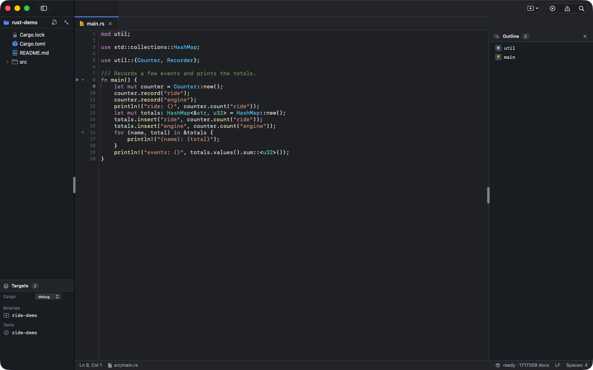

Completions come from the open buffer, the workspace and every crate already on disk, including the rustc sysroot, in under a millisecond. Rows carry the signature, origin crate and an `use` tag when accepting will add the import; the doc card on the right shows the documentation of the selected row.

Reformat Document runs rustfmt, clang-format (found in the Xcode toolchain, so no Homebrew install is needed), taplo or cmake-format when installed, and a built-in Makefile formatter. Editing basics follow RustRover's menus: smart Enter, Tab and ⇧Tab on a selection, ⌘/ comments, bracket pairing, duplicate, delete, join and move lines, extend selection (⌥↑), matching brace, folding, Surround With, Back/Forward (⌘[ / ⌘]), Go to Line (⌘L), Recent Files (⌘E), next problem (F2) and header/source switch. ⌘? lists every shortcut.

## Cheat sheet

A second popup shows the part of the language cheat sheet that fits the caret: items at file level, statements inside a body, patterns in a `match` arm, `$(...)` functions in a Makefile. Rust, C, C++ and GNU Make each ship a full sheet (about 1,900 templates in total) as TOML data under `cheatsheets/`.

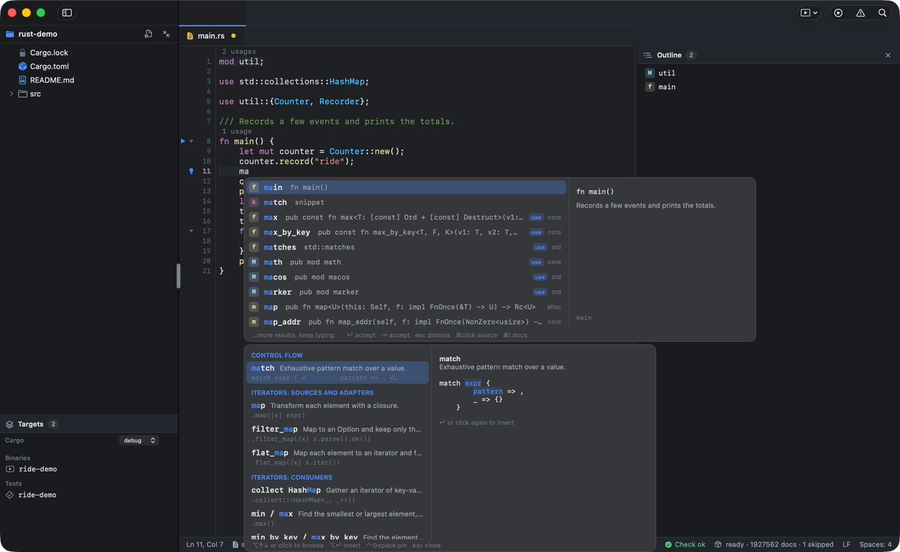

Arrow keys or a click select a row and the preview pane shows the complete example with its placeholders; `↩`, `⇥`, a second click on the selected row or a double-click inserts it as a snippet with tab stops. The sheet follows the completion popup automatically (preference "Cheat sheet with completions"); `⌃⇧Space` pins it open on its own. With both popups open, `⌥↑` / `⌥↓` or a click move focus to the sheet and `⌥↩` inserts.

## Editing

Hover an identifier for its signature and first doc paragraph; F12 jumps to the definition in the buffer, a crate on disk or an included header.

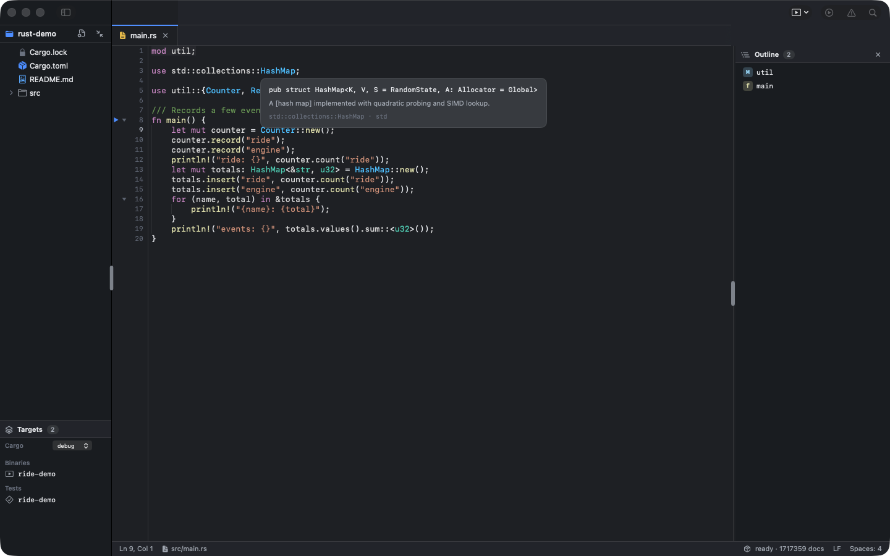

`cargo check` runs on save (or ⌥⌘B), and `clang -fsyntax-only` does the same for C and C++ files with flags from `compile_commands.json`. Diagnostics land in the Problems panel and as underlines in the editor.

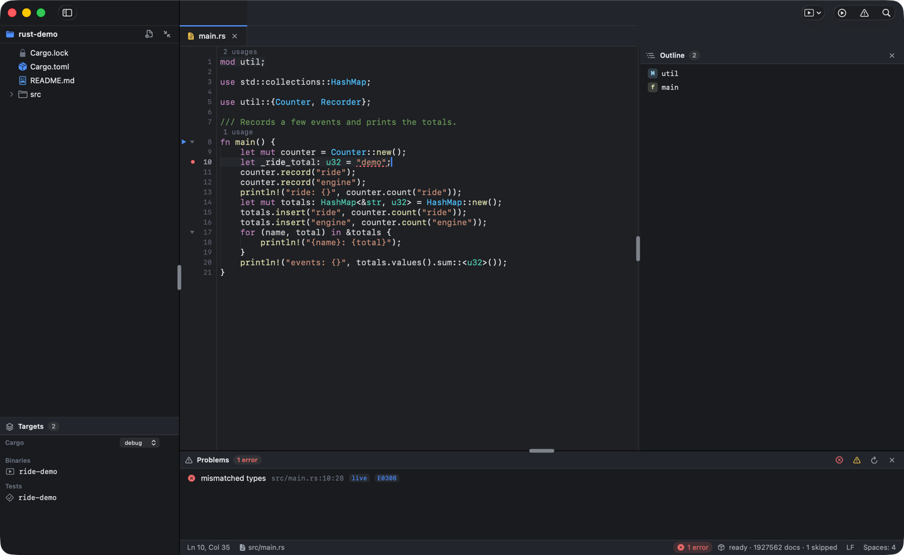

C++ files get the same treatment: highlighting, outline, member and `::` completion through the included headers, definitions into `include/` and clang-format.

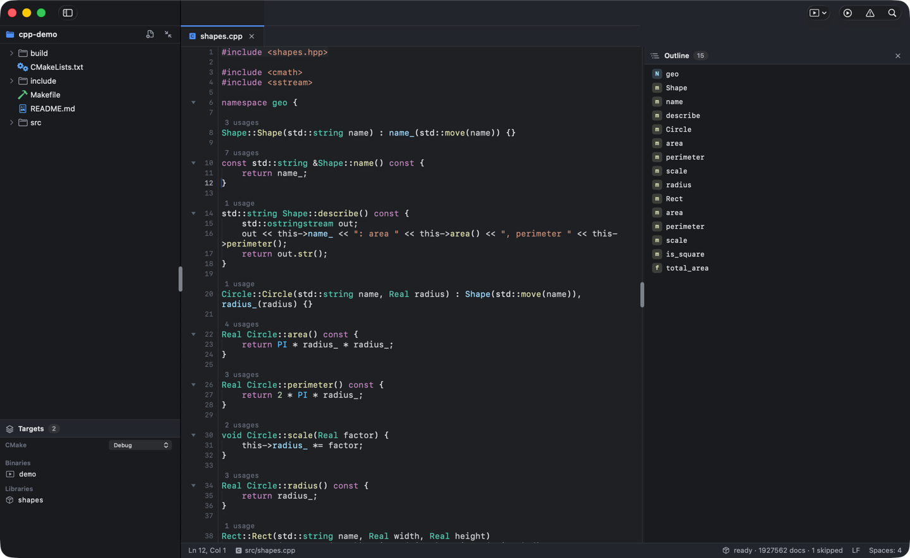

Makefiles have an outline of targets and variables, highlighting of automatic variables and functions, and completion for GNU make directives, functions and builtin variables.

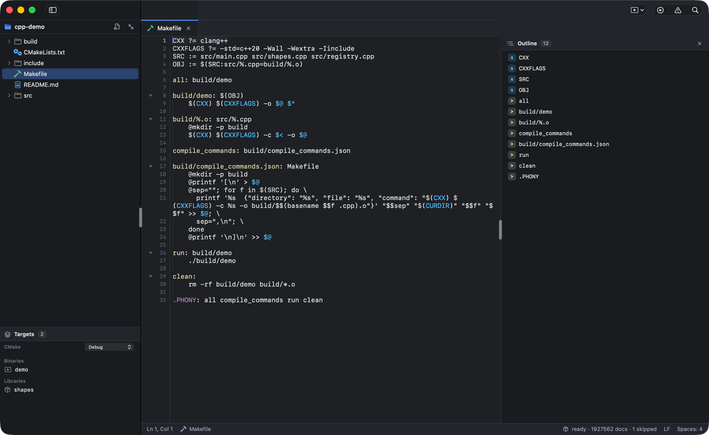

## Build, run, test and debug

The project model reads `cargo metadata`, the CMake File API, a Makefile or a bare `compile_commands.json` and lists the targets in the sidebar. ⌘B builds the selected target, ⌘R runs it, ⇧⌘R runs its tests and ⌃⌘R debugs it; run configurations (arguments, environment, working directory, `RUST_BACKTRACE`, sanitizers) are saved with the workspace. Build errors from Cargo and clang land in the Problems panel, run output goes to a panel with clickable `path:line:col` links, a ▶ in the gutter runs a single test, and the Tests panel groups results per suite with output per test and Rerun Failed. A terminal panel on SwiftTerm opens with ⌥F12.

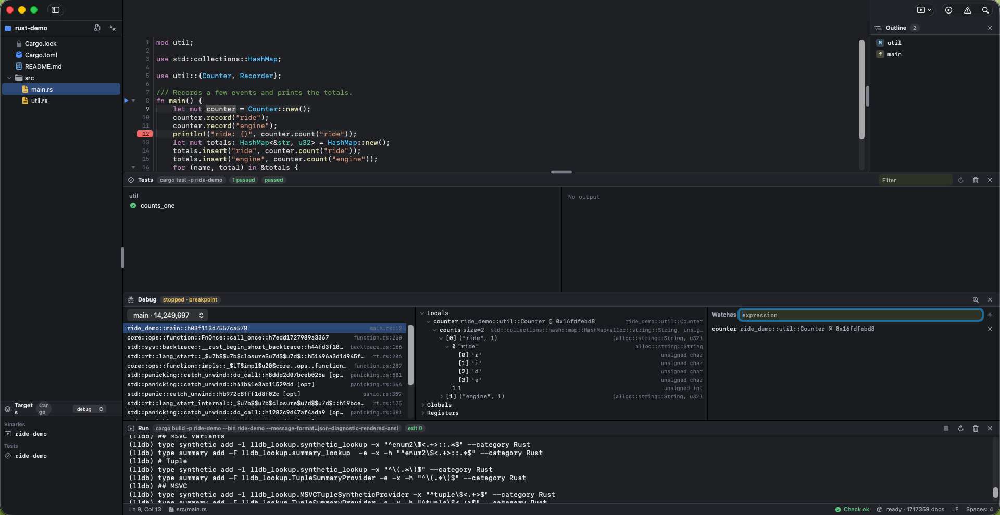

The debugger drives `lldb-dap` from Xcode. Click a line number to set a breakpoint, right-click it for a condition or hit count; C++ exception and Rust panic breakpoints are in the Debug menu. F7, F8 and ⇧F8 step, ⌘F2 stops. The Debug panel (⌘3) shows threads and frames, a lazily expanded locals tree with the toolchain's Rust formatters and lldb's libc++ ones, watches re-evaluated on every stop, and Evaluate Expression (⌥F8); hovering an identifier while stopped shows its value. Debugging needs macOS developer mode (`sudo DevToolsSecurity -enable`, once).

## Navigation and search

⇧⌘R searches every symbol in the workspace and the crate catalog; ⌘P opens files quickly; ⇧⌘F finds text across the project.

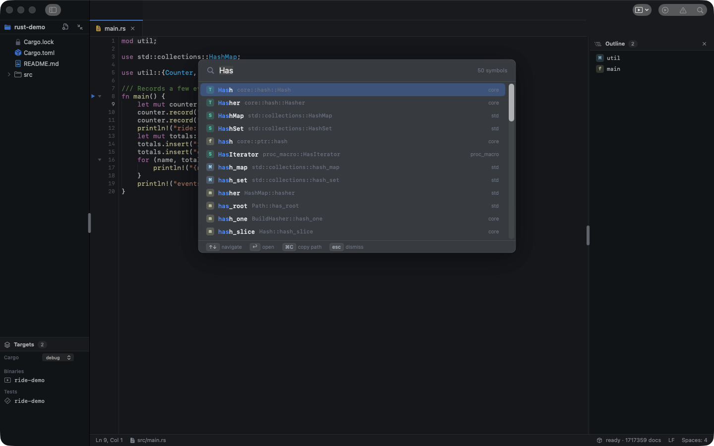

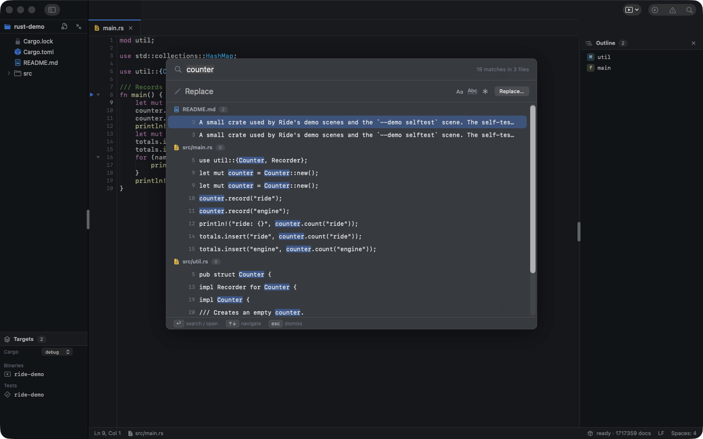

Markdown files get tree-sitter highlighting, a heading outline and a rendered preview with highlighted code fences.

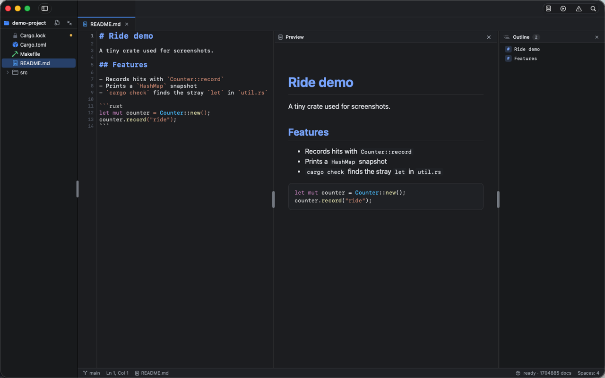

Light and dark themes are peers; every screen above is also reviewed in light.

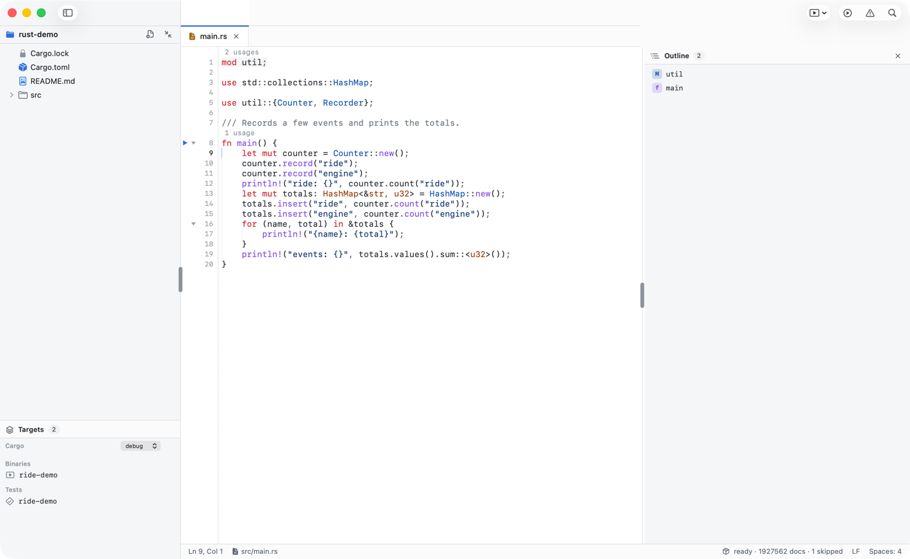

## Install

```sh
./scripts/install.sh            # builds a Release Ride.app and installs it to /Applications
./scripts/install.sh ~/Applications
```

Requires Xcode and a Rust toolchain (rustup); the script adds the `rust-src` component if it is missing.

## Build and run

```sh
cargo test                       # engine tests
cargo clippy --all-targets -- -D warnings
./scripts/build-engine.sh        # xcframework + Swift bindings + ride-engine CLI
./scripts/run.sh [folder]        # build Ride.app and open a folder
xcodebuild -downloadComponent MetalToolchain   # once per machine, for SwiftTerm's shaders
```

Two sample projects exercise the C and C++ support end to end (member completion through headers, go to definition into `include/`, `compile_commands.json`-driven diagnostics, clang-format): `./scripts/run.sh samples/c-demo` or `samples/cpp-demo`, each with a README checklist. `samples/rust-demo` is the crate the `--demo selftest` scene drives (run it on a copy, the scene saves its edits).

The one-shot indexer writes to `~/Library/Application Support/Ride/index/`:

```sh
target/debug/ride-engine index --project-path . --index-dir <dir> [--force]
target/debug/ride-engine query HashMap --index-dir <dir>
target/debug/ride-engine complete src/main.rs --find "let x = " --typed "Has"
target/debug/ride-engine cheat src/main.rs --find "fn main() {" --typed $'\n    ma'
target/debug/ride-engine status --index-dir <dir>
```

Screenshots come from the demo scenes: `Ride.app --args --open <folder> --demo <scene> --frame 1440x900` (`editor`, `completion`, `cheatsheet`, `hover`, `quickopen`, `symbols`, `find`, `problems`, `preview`, `outline`, `light`, `file --file <path>`), captured by window bounds.

## Where things live

- `docs/README.md` — documentation index
- `plan/ride_draft.md` — product and architecture spec (authoritative)
- `plan/roadmap/improve-extend.md` — current roadmap
- `plan/roadmap/cheatsheet.md` — cheat sheet design
- `plan/roadmap/must_have.md` — must-have editor commands (first priority)
- `plan/roadmap/next.md` — next features and releases
- `todo/` — open follow-ups per module
- `AGENTS.md` — engineering rules for this repo
