# Ride

Native macOS IDE for Rust, with C and C++ editing. A SwiftUI/AppKit shell (`app/`) over a Rust language engine (`src/`) that discovers crates on disk, extracts items with tree-sitter, indexes them with Tantivy, and answers completion, highlight and outline queries in-process through UniFFI. C and C++ buffers get tree-sitter highlighting, outline, parse errors, keyword, member and header-aware completion, definitions across included headers and clang-format. TOML, Makefiles and CMake files get highlighting, an outline and keyword plus buffer-local completion.


Completions come from the open buffer, the workspace and every crate already on disk, including the rustc sysroot, in under a millisecond. Rows carry the signature, origin crate and an `use` tag when accepting will add the import; the doc card on the right shows the documentation of the selected row.


Reformat Document runs rustfmt, clang-format (found in the Xcode toolchain, so no Homebrew install is needed), taplo or cmake-format when installed, and a built-in Makefile formatter. Editing basics follow RustRover's menus: smart Enter, Tab and ⇧Tab on a selection, ⌘/ comments, bracket pairing, duplicate, delete, join and move lines, Move Statement (⇧⌘↑ / ⇧⌘↓), which lifts a whole block over its neighbour instead of one line, extend selection (⌥↑), matching brace, folding, Surround With, Back/Forward (⌘[ / ⌘]), Go to Line (⌘L), Recent Files (⌘E), next problem (F2) and header/source switch. ⌘? lists every shortcut.

## Cheat sheet

A second popup shows the part of the language cheat sheet that fits the caret: items at file level, statements inside a body, patterns in a `match` arm, `$(...)` functions in a Makefile. Rust, C, C++, GNU Make, CMake and Cargo manifests each ship a sheet — about 2,000 templates across the six — as TOML data under `cheatsheets/`.


Arrow keys or a click select a row and the preview pane shows the complete example with its placeholders; `↩`, `⇥`, a second click on the selected row or a double-click inserts it as a snippet with tab stops. The sheet follows the completion popup automatically (preference "Cheat sheet with completions"); `⌃⇧Space` pins it open on its own. With both popups open, `⌥↑` / `⌥↓` or a click move focus to the sheet and `⌥↩` inserts.

## Editing

Hover an identifier for its signature and first doc paragraph; F12 jumps to the definition in the buffer, a crate on disk or an included header.


⌃J (or F1) opens Quick Documentation for the symbol at the caret: the whole doc block rendered as HTML under its signature, intra-doc links that load inside the panel and a pin that keeps it open across caret moves; ⌘I shows the same card for the selected completion row and ⇧F1 opens docs.rs or cppreference.

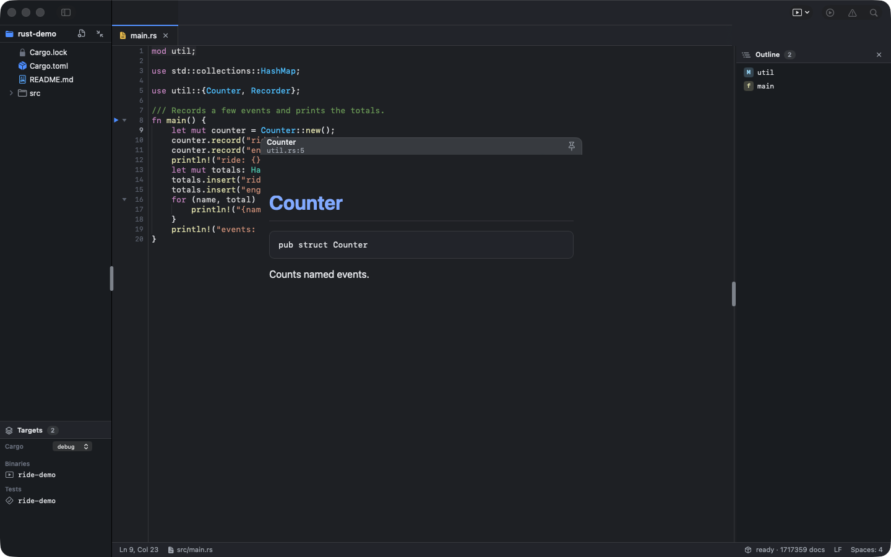

⌥Space peeks the definition without leaving the file: the source excerpt with its own highlighting, one segment per declaration and implementation, and Open to jump there.

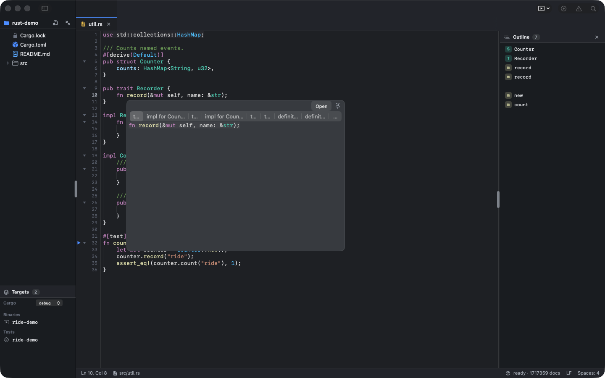

⌘\ splits the editor into two panes, each with its own tabs, popups and history; Open in Split moves the current tab across and F10 opens the sibling header or source in the other pane.

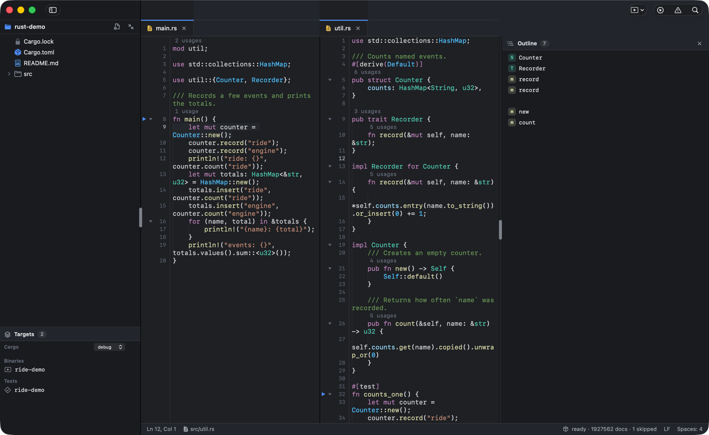

`cargo check` runs on save (or ⌥⌘B), and `clang -fsyntax-only` does the same for C and C++ files with flags from `compile_commands.json`. Diagnostics land in the Problems panel and as underlines in the editor.


The same checks also run while you type. The unsaved buffer goes to clang in memory, and the underline and the Problems row appear with a `live` badge a moment after the typo, then clear themselves when the line is fixed; nothing is written to disk in between.

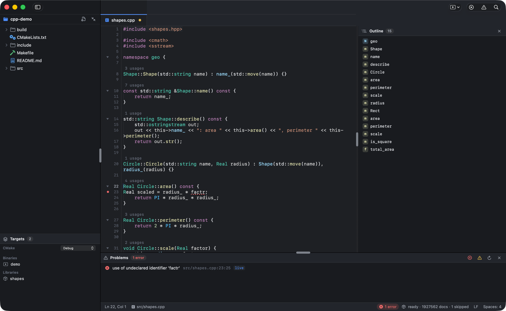

C++ files get the same treatment: highlighting, outline, member and `::` completion through the included headers, definitions into `include/` and clang-format.


C sources get member completion through `.` and `->` from the struct behind the expression, with the C cheat sheet below the list.

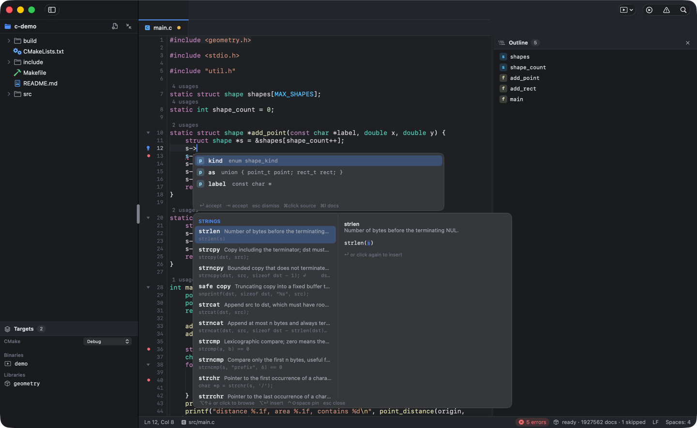

Makefiles have an outline of targets and variables, highlighting of automatic variables and functions, and completion for GNU make directives, functions and builtin variables.


CMake files get the same: highlighting of commands, variables and options, an outline of the project, its variables, functions and targets, and a CMake cheat sheet.

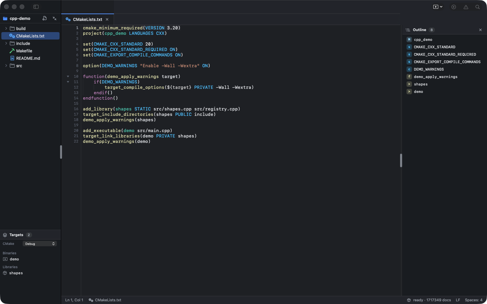

`Cargo.toml` and other TOML files get table and key completion backed by the manifest cheat sheet.

![Completion on a partial key under [package] in Cargo.toml, with the manifest cheat sheet below it](docs/images/ride-toml.png)

## Understand and change

⌥F7 finds every usage of the symbol at the caret. The panel groups the hits by file and by enclosing item, keeps the ones from the file that defines the symbol at the top and folds the rest under Other matches.

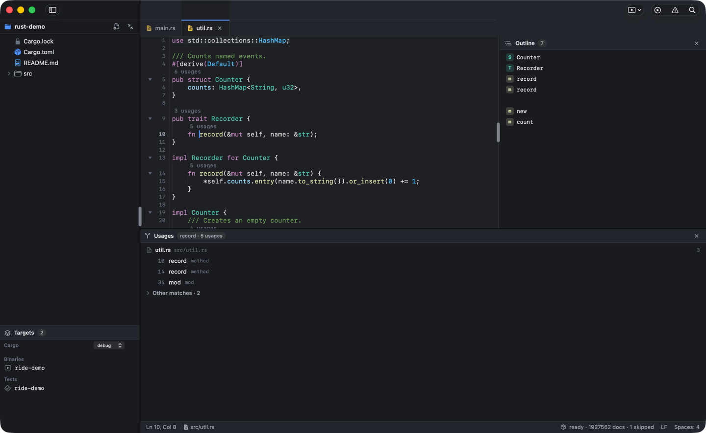

Code vision writes a grey "N usages" line above every item in the file, counted from the same index, and a click on it opens the usages.

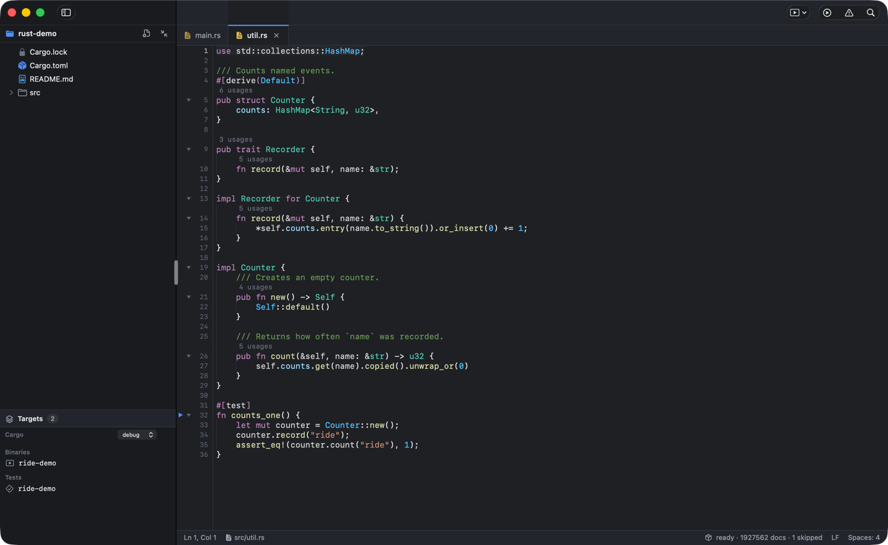

⇧F6 renames. A rename that stays inside one scope is applied in place; one that reaches other files opens a preview sheet first. Occurrences the engine verified are ticked, and everything it could not prove is the same symbol waits under Review until you tick it.

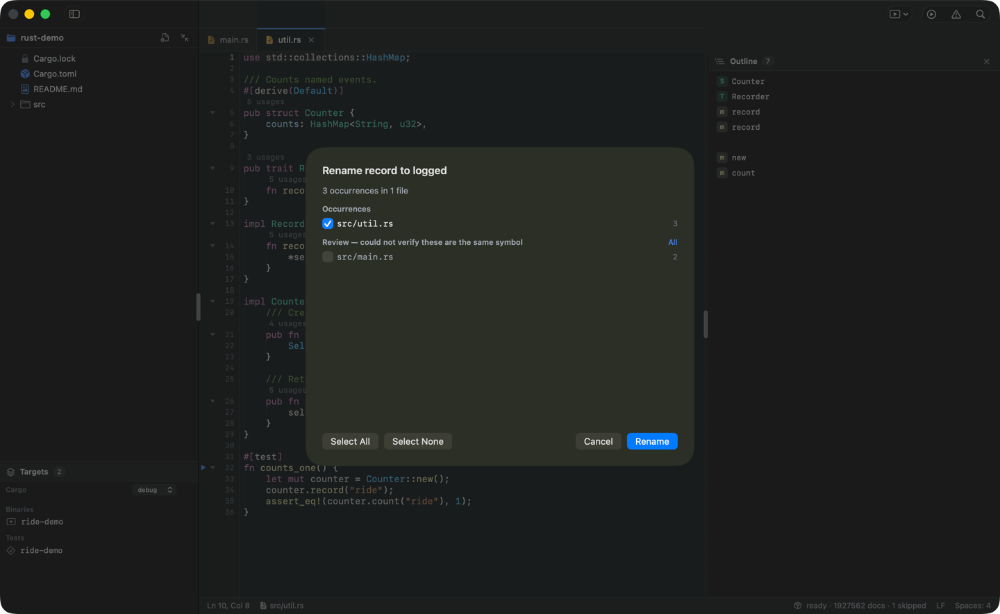

⌃⌥H opens the call hierarchy of the function at the caret and ⌃H its type hierarchy. Rows expand into their own callers, the Callers/Callees/Types tabs switch the direction, and a click jumps to the call site.

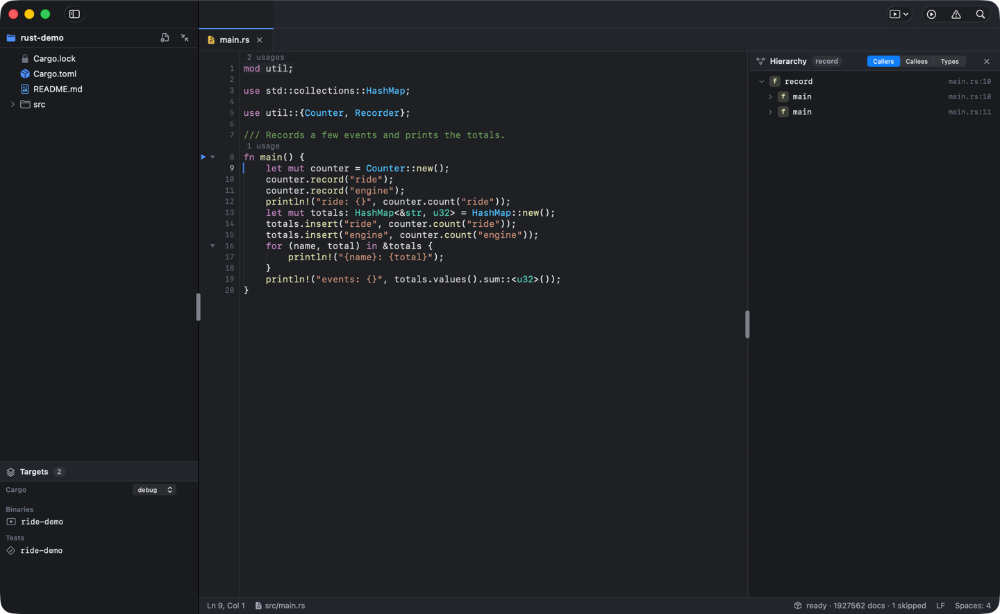

⌥↩ opens the intention menu on the caret's line: fixes for the compiler diagnostic under it, imports for an unresolved name, the missing arms of a `match`, and the refactorings that fit the selection. A bulb in the gutter marks the lines that have one.

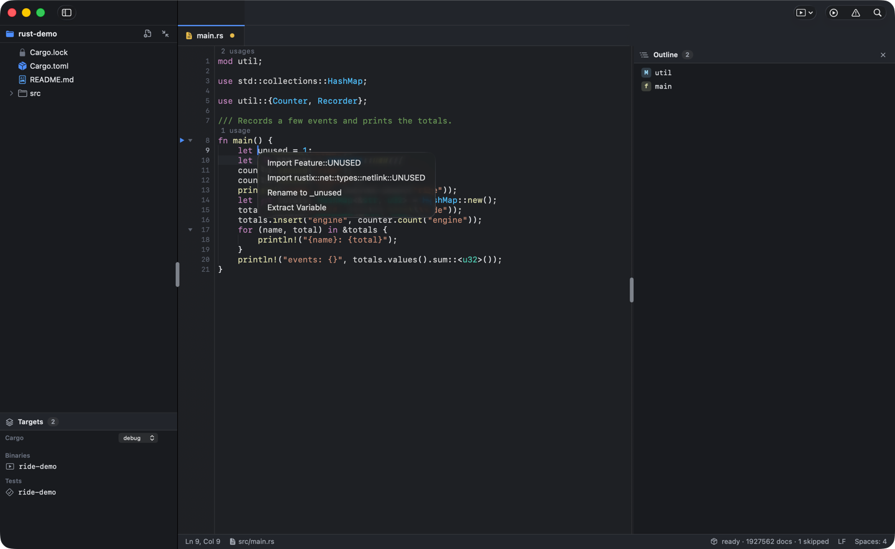

Extract Variable (⌥⌘V), Introduce Constant (⌥⌘C), Inline Variable (⌃⌥N) and Safe Delete (⌥⌘⌫) work on the same engine index, in Rust and in C and C++; Safe Delete lists the usages that would break before it removes anything. Generate (⌃⌘G) offers what the item at the caret is missing — a constructor or `new`, getters and setters, an `impl` block, `Default`, `Display`, equality operators, a stream insert.

## Build, run, test and debug

The project model reads `cargo metadata`, the CMake File API, a Makefile or a bare `compile_commands.json` and lists the targets in the sidebar. ⌘B builds the selected target, ⌘R runs it, ⇧⌘R runs its tests and ⌃⌘R debugs it; run configurations (arguments, environment, working directory, `RUST_BACKTRACE`, sanitizers) are saved with the workspace. Build errors from Cargo and clang land in the Problems panel, run output goes to a panel with clickable `path:line:col` links, a ▶ in the gutter runs a single test, and the Tests panel groups results per suite with output per test and Rerun Failed. A terminal panel on SwiftTerm opens with ⌥F12.

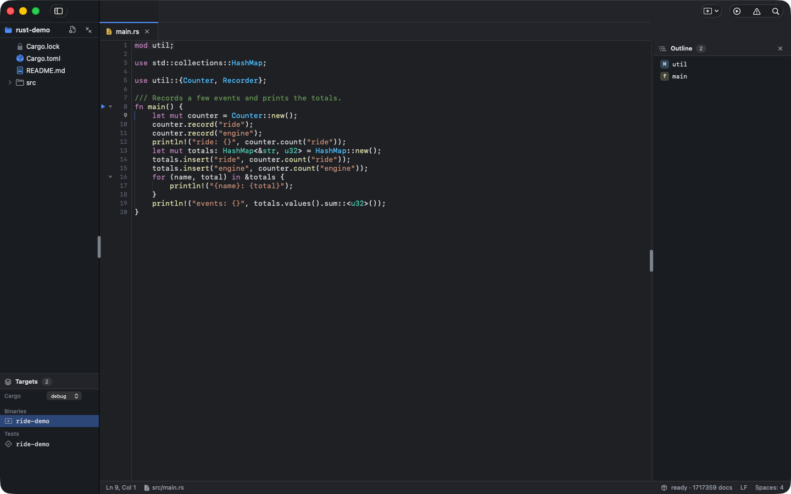

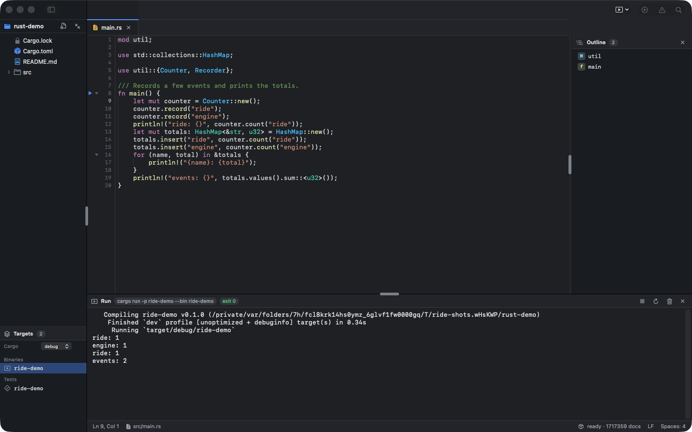

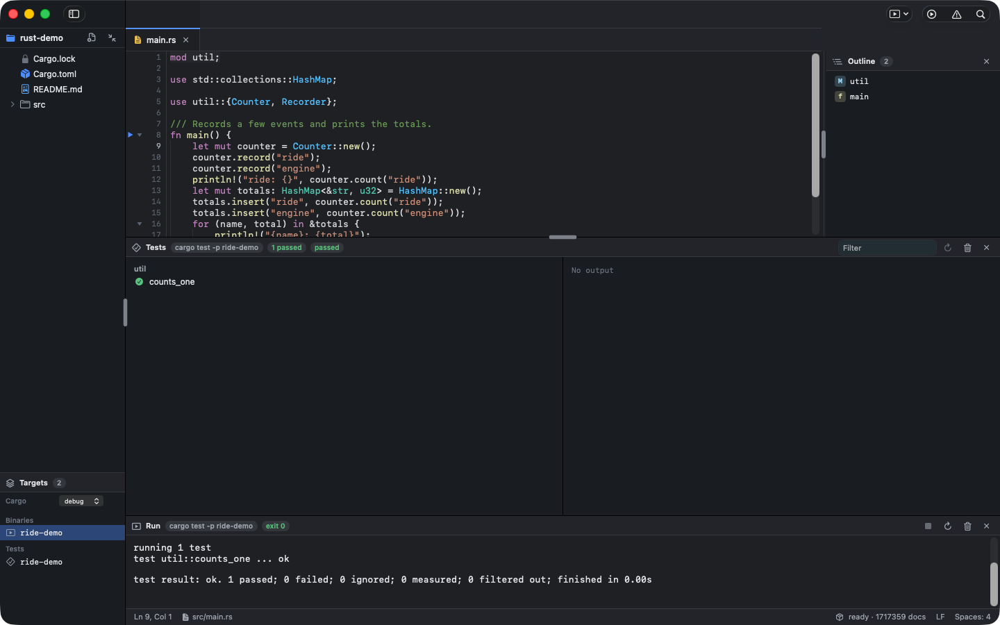

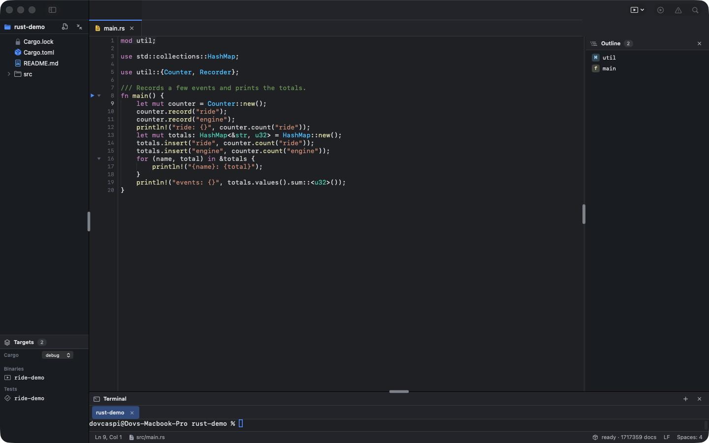


The debugger drives `lldb-dap` from Xcode. Click a line number to set a breakpoint, right-click it for a condition or hit count; C++ exception and Rust panic breakpoints are in the Debug menu. F7, F8 and ⇧F8 step, ⌘F2 stops. The Debug panel (⌘3) shows threads and frames, a lazily expanded locals tree with the toolchain's Rust formatters and lldb's libc++ ones, watches re-evaluated on every stop, and Evaluate Expression (⌥F8); hovering an identifier while stopped shows its value. Debugging needs macOS developer mode (`sudo DevToolsSecurity -enable`, once).

C and C++ binaries take the same path: CMake builds the target, the breakpoint is sent in the spelling the debug info holds, and the frames come back with libc++ formatters, so a `std::vector` opens into its elements. Stopping inside a method of the cpp-demo sample and stepping back out to its caller is checked by the self-test on every run.

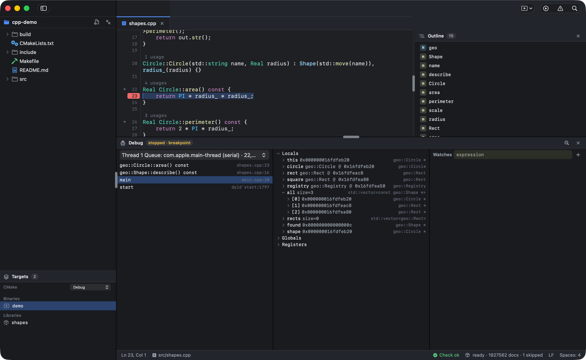

## Navigation and search

⌘F opens the find bar above the editor with next and previous, match case, whole word, regular expression and a replace field (⌥⌘F); ⇧⌘R searches every symbol in the workspace and the crate catalog; ⌘P opens files quickly; ⇧⌘F finds text across the project.

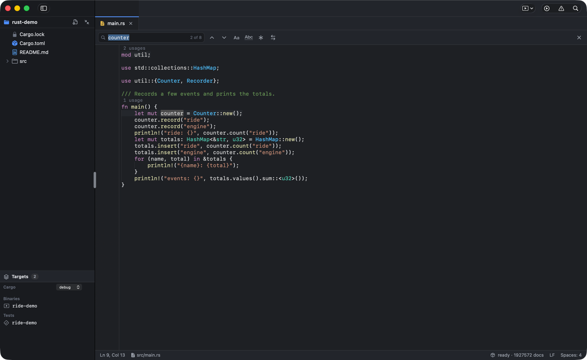


Markdown files get tree-sitter highlighting, a heading outline and a rendered preview with highlighted code fences.

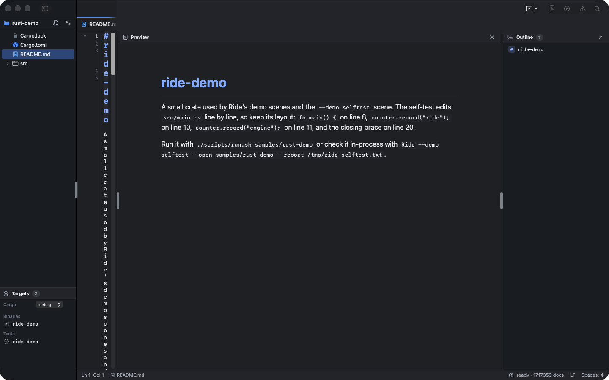

Light and dark themes are peers; every screen above is also reviewed in light.


## Getting started

With no folder open, Ride offers a copy of the Rust, C or C++ sample instead of an empty window, and lists under Set up whatever it still needs — Command Line Tools, rustup, the `rust-src` component, CMake, developer mode for the debugger — with the command that installs each one. The list is gone once they are all there, as below.

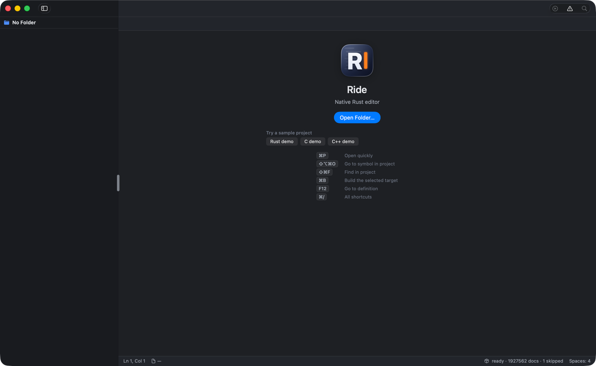

Settings installs a `ride` command in `/usr/local/bin`. `ride .` opens a folder, `ride src/main.rs:20:5` opens a file in the running app and puts the caret on that line and column; both go through the `ride://open` URL scheme. If Ride ever dies on a signal, the next launch offers the crash report it wrote, with a button that copies it for an issue.

## Install

```sh
brew tap ReOpsIL/ride
brew install --cask ride
```

Or download the zip from [GitHub Releases](https://github.com/ReOpsIL/ride/releases/latest).

From source:

```sh
./scripts/install.sh            # builds a Release Ride.app and installs it to /Applications
./scripts/install.sh ~/Applications
```

Requires Xcode and a Rust toolchain (rustup); the script adds the `rust-src` component if it is missing.

## Build and run

```sh
cargo test                       # engine tests
cargo clippy --all-targets -- -D warnings
./scripts/build-engine.sh        # xcframework + Swift bindings + ride-engine CLI
./scripts/run.sh [folder]        # build Ride.app and open a folder
xcodebuild -downloadComponent MetalToolchain   # once per machine, for SwiftTerm's shaders
```

Two sample projects exercise the C and C++ support end to end (member completion through headers, go to definition into `include/`, `compile_commands.json`-driven diagnostics, clang-format): `./scripts/run.sh samples/c-demo` or `samples/cpp-demo`, each with a README checklist. `samples/rust-demo` is the crate the `--demo selftest` scene drives (run it on a copy, the scene saves its edits).

The one-shot indexer writes to `~/Library/Application Support/Ride/index/`:

```sh
target/debug/ride-engine index --project-path . --index-dir <dir> [--force]
target/debug/ride-engine query HashMap --index-dir <dir>
target/debug/ride-engine complete src/main.rs --find "let x = " --typed "Has"
target/debug/ride-engine cheat src/main.rs --find "fn main() {" --typed $'\n    ma'
target/debug/ride-engine status --index-dir <dir>
```

Every screenshot above is regenerated by `./scripts/screenshots.sh`. It builds the Debug app and runs one demo scene per image on a temporary copy of the sample it needs: `Ride --open <folder> --demo <scene> --frame 1440x900 --ready-file <path> --quit-after <seconds>`. Each scene stages itself in-process without synthetic input and touches the ready file when it is on screen; the script then reads the window ids of that process through `CGWindowListCopyWindowInfo` (`scripts/windowid.swift`), captures each window with `screencapture -l`, composes them (`scripts/compose.swift`) and checks the result is not a single colour (`scripts/pngcheck.swift`). The scenes are `editor`, `completion`, `cheatsheet`, `hover`, `quickdoc`, `peek`, `split`, `symbols`, `find`, `findbar`, `preview`, `light`, `problems`, `toml`, `c`, `cpp`, `makefile`, `cmake`, `targets`, `run`, `tests`, `terminal`, `debug`, `welcome`, `usages`, `hierarchy`, `codevision`, `rename`, `intentions`, `livecheck` and `cppdebug`, plus `quickopen`, `outline`, `tools`, `unformatted`, `empty`, `file --file <path>` and `selftest`. `welcome` runs without `--open`; `livecheck` and `cppdebug` need the C++ sample, and `cppdebug` needs developer mode.

## Where things live

- `docs/README.md` — documentation index
- `plan/ride_draft.md` — product and architecture spec (authoritative)
- `plan/roadmap/improve-extend.md` — current roadmap
- `plan/roadmap/cheatsheet.md` — cheat sheet design
- `plan/roadmap/must_have.md` — must-have editor commands (first priority)
- `plan/roadmap/next.md` — next features and releases (1.1 and 1.2, done)
- `plan/roadmap/next-1.3.md` — coding, completion, running and debugging after 1.2
- `todo/` — open follow-ups per module
- `AGENTS.md` — engineering rules for this repo
