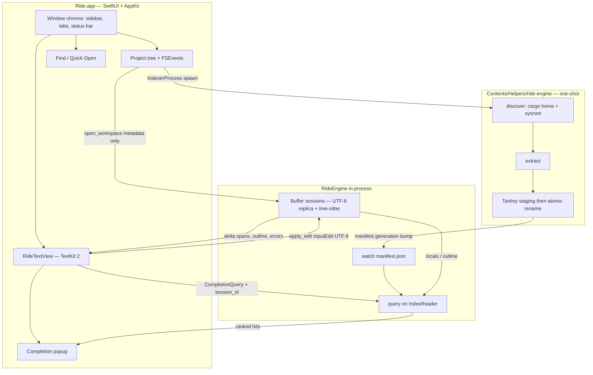

# Ride — Native macOS Rust IDE

| Field | Value |
|---|---|
| **Title** | Ride — Product and Architecture Spec |
| **Author** | Ride contributors |
| **Date** | 2026-09-02 |
| **Status** | In progress |
| **Canonical path** | `plan/ride_draft.md` |
| **Supersedes** | the previous product draft in this file; `plan/autocomplete.md` remains source notes and is merged here in full |

This document is the implementation spec for Ride. An engineer should be able to build the Swift IDE and the Rust language engine from it without reading `plan/autocomplete.md`.

---

## Overview

Ride is a single-purpose native macOS IDE for Rust. The user opens a Cargo project, edits with tree-sitter syntax highlighting, jumps around files and symbols, and gets fast **local** completions from (1) the current buffer, (2) the workspace, and (3) a catalog of crates already on disk — Cargo’s unpack cache **and** the rustc sysroot (`std` / `core` / `alloc`) when `rust-src` is installed. It is not VS Code, not a plugin host, not a cloud coding agent, and not a general-purpose editor.

The product is two tightly coupled pieces:

1. **Ride.app** — a SwiftUI + AppKit IDE shell. Windows, tabs, project tree, TextKit 2 editor, completion popup, find, status bar. Looks like a conventional IDE (RustRover / Xcode layout), without the feature surface of one. One editor split is optional polish, not a 1.0 gate.
2. **RideEngine** — a Rust library (this repo’s `ride` crate, renamed `ride-engine`) that discovers crates, extracts items, builds a Tantivy index, and answers keystroke queries in **under 20–50 ms**. Incremental parse and lexical query run **in-process**. Index writing (and later ONNX) runs in a **one-shot child** `Contents/Helpers/ride-engine` so a bad crate or embedder abort does not take down the editor. The in-process engine **watches** `index_dir/manifest.json` and reopens `IndexReader`; it does not spawn the child.

Autocomplete is a **local index + hybrid retrieval** system plus ordinary editor sources (keywords, locals, current-file outline). It is not a generative LLM on every keypress. Cloud completion (Kimi 2.7 Coder via OpenRouter, ghost-text streaming, Keychain API keys, cost indicators) is a **rejected alternative** for the live list. A local 1–3B model may appear later only to explain a selected hit, never to produce the popup.

**1.0 ships on engine v0** (lexical Tantivy + prefix/fuzzy, no embeddings, no rustdoc JSON, no local LLM). Builds, `cargo test`, and type-checker diagnostics stay in an **external terminal** until a later phase.

---

## Background & Motivation

### Why this exists

Rust developers on macOS currently choose among:

- **RustRover / CLion** — excellent language intelligence, heavy, commercial, dense with settings.
- **VS Code + rust-analyzer** — capable, non-native, plugin-shaped, easy to turn into a general IDE.
- **Zed / Helix / Neovim** — fast editors, not a small Cargo-project IDE with a project tree and crate-catalog search.

Ride’s bet: a **small native app** that does the mandatory *edit and navigate* loop well — open project, edit, highlight, jump, complete from *what is actually on this machine* — and refuses everything else. It does **not** replace a terminal for `cargo test` / `cargo check` in 1.0.

### Current repo state

Workspace: `/Users/dovcaspi/develop/ride`.

**Done:** PR-E0, PR-E6s, PR-E1–E6, PR-A0–A2c, PR-A4–A7, PR-A9 overlay on save/tree. Run with `./scripts/run.sh [folder]`. Completions as you type (Tab/Enter accept, Esc dismiss). Syntax highlighting, **Cmd+R**, outline, **Cmd+P** / **Cmd+F**.

| Path | What it is today |
|---|---|
| `Cargo.toml` | Package `ride-engine`, edition 2024. `crate-type = ["lib", "staticlib", "cdylib"]`. `[[bin]] name = "ride-engine"`. Deps include `clap`, `thiserror`, `tree-sitter` **0.27.0**, `tree-sitter-rust` **0.23.3**, `uniffi` 0.29, `tantivy` 0.24, `serde`/`toml`. |
| `src/lib.rs` | Library + UniFFI scaffolding. `engine_start` plus query and buffer-session methods. |
| `src/extract/` | Item extractor with module-graph paths, `impl` methods, `pub use`, leftover `src/` scan. |
| `src/discover/` | `$CARGO_HOME` registry + git, `rustc --print sysroot`, `cargo metadata --offline` with one online retry. |
| `src/index/` | Tantivy schema + one-shot writer: `staging-{pid}/` → `gen-N` + `manifest.json` + `status.jsonl`. Catalog `pub` only. |
| `src/query/` | Prefix / BM25 completions, rustdoc `fn:` / `struct:` filters, keywords, overlay drop. |
| `src/highlight/` | Buffer sessions: UTF-8 `InputEdit`, highlight deltas, outline, parse errors. |
| `src/ffi/` | Closed 1.0 UniFFI types. Engine watches `manifest.json` / `status.jsonl`, reopens `IndexReader`, drops stale `query_id`. |
| `src/bin/ride_engine.rs` | CLI: `--project-path`, `index` / `query` / `status`. |
| `scripts/build-engine.sh` | `aarch64-apple-darwin` lib + CLI + UniFFI Swift + xcframework. |
| `scripts/run.sh` | `xcodebuild` Debug and `open Ride.app`. |
| `app/Ride.xcodeproj` | macOS 14 SwiftUI shell. Dark chrome, project tree, TK2 editor, Cmd+P / Cmd+F, preferences. Links `RideEngine.xcframework`; copies `ride-engine` to `Contents/Helpers/`. |
| `src/project/symbols.rs` | **Deleted** (PR-E1). |
| `plan/autocomplete.md` | Historical engine notes. |
| `plan/ride_draft.md` | This spec (authoritative). |

Tree-sitter pins stay; ABI 14 (0.23.3) is in 0.27’s supported range. `set_language` smoke test lives in `tests/extract.rs`.

### Pain points this spec resolves

1. The product draft and the engine notes **contradicted** each other on autocomplete (cloud LLM vs local index). The engine notes win.
2. There is no editor. Completions with nowhere to type them are not a product.
3. The crate is a CLI experiment, not a library the app can link.
4. Scope was drifting toward “small VS Code” (command palette, Vim, terminal, AI cost UI). Ride is a Rust editor, not an ecosystem.

---

## Goals & Non-Goals

### Goals (v1 / 1.0)

A developer can **edit and navigate a local Cargo project** on a Mac, with syntax highlighting and local completions, **without opening another editor for that loop**. Builds, tests, and `cargo check` stay in an **external terminal** until phase 2. This is not “never switch tools”; it is “do not switch editors to type Rust.”

In 1.0:

- Open a folder that contains (or is) a Cargo project.
- Browse, create, rename, delete (via Trash) files; reveal in Finder; tree stays in sync with disk.
- Edit Rust in a multi-tab editor with line numbers, current-line highlight, SF Mono, 4-space soft tabs, auto-save. (One split is optional polish; see PR-A3.)
- See tree-sitter syntax highlighting and parse-error underlines while typing.
- Jump to a file (`Cmd+P`), find in file (`Cmd+F`), jump to a symbol in the current file (`Cmd+R`), browse a current-file outline. Project-wide find (`Cmd+Shift+F`) is v1-nice, not a 1.0 gate.
- Get a completion popup as they type from **buffer locals + keywords + file outline**, then workspace `pub` items, then catalog `pub` items (registry + sysroot), in **<20–50 ms** engine time after the query is issued.
- Open a crate-cache or sysroot hit in its on-disk source.
- See index status, cursor position, and a `rust-src` missing hint in a compact status bar.

### Non-goals (v1 — do not sneak back in)

- Plugin marketplace, multi-language, remote/SSH, debugger.
- Git UI (dirty badges may come later; no commit/diff/merge).
- Snippet GUI, keymap GUI, settings sprawl, command palette (`Cmd+Shift+P`).
- AI chat panel, cloud inference, OpenRouter, Keychain model keys, cost/rate indicators.
- Indexing all of crates.io.
- Executing crate build scripts while indexing (engine v0/v1). Engine v2 rustdoc JSON **does** compile crates and **is not in 1.0**; see KD-17.
- Vim bindings, integrated terminal, `cargo check` / `rustc` diagnostics panel, light-theme polish.
- rust-analyzer / LSP in process.
- Auto-import of `use` statements on completion accept.
- Streaming “ghost text” of a generative model.
- Embeddings / hybrid search / local LLM (engine v1+ / v3) as a 1.0 requirement.
- MCP server or TUI frontend (present in `plan/autocomplete.md` source notes; **not** Ride product surfaces).
- HTTP as the editor↔engine hot path.

`cargo check` is **not** in 1.0. Tree-sitter parse-error underlines catch broken syntax while typing; type and borrow errors wait for a later phase. An integrated terminal and Vim mode are the same class of “nice for some, not required to type Rust.”

---

## Key Decisions

### KD-1 — Swift owns the IDE shell; Rust owns the language engine. Do not move autocomplete to Swift.

**Decision:** Ride.app is Swift (SwiftUI chrome + AppKit `NSTextView`). RideEngine is Rust and stays Rust. The existing crate is the engine, not a sketch to be rewritten in Swift.

**Rationale:**

- The engine stack — Tantivy, syn, nucleo/FST, tree-sitter-rust, fastembed/ort, sqlite-vec, notify — is **Rust-native**. It does not exist as a first-class Swift stack. Reimplementing Tantivy+ONNX+crate walking in Swift would be a multi-month detour for a worse result.
- This repo already has a Rust crate with tree-sitter-rust in `Cargo.toml` and a symbol-extraction seed in `src/project/symbols.rs`.
- Indexing thousands of crate versions and answering in <50 ms belongs in a systems language with this ecosystem (memory control, zero-GC pauses on the query path, existing crates).
- Swift is the right tool for a native Mac editor: windowing, TextKit, accessibility, services, file dialogs, key equivalents, SF symbols, Dark Mode. Rust is a poor fit for AppKit.
- Splitting the wrong way (Swift engine, or Rust UI via something like iced) would fight both platforms.

**Residual choice:** none on the language split. FFI mechanism is KD-3.

### KD-2 — Autocomplete is local lexical/hybrid retrieval, not a cloud LLM.

**Decision:** The completion popup is served by RideEngine (Tantivy prefix/BM25, later optional embeddings + RRF) **plus** buffer-local sources. Kimi 2.7 Coder via OpenRouter, streaming ghost text, and per-request token budgets are **rejected** for v1 typeahead.

**Rationale:** Live autocomplete must return in **<20–50 ms**. A round-trip to OpenRouter plus a generative decode is typically hundreds of milliseconds to seconds, costs money, requires a network and an API key, and sends source off-machine. rust-analyzer already fuzzy-searches the current workspace; Ride’s extra catalog value is a **global, offline catalog** of crates on disk — a search problem, not a generation problem.

A local 1–3B model is allowed later as **Layer 3**, only after a hit is chosen (“explain this item”), never to fill the live list.

### KD-3 — In-process FFI for parse + query; localhost HTTP is debug-only; indexer is a child process.

**Decision:** The app links `RideEngine.xcframework` (`staticlib` + `cdylib` + UniFFI Swift bindings). Incremental parse (`apply_edit`) and lexical `query_completions` go **in-process**. A `127.0.0.1` HTTP server is a Cargo feature (`http-debug`) for CLI/manual testing, **not** the editor hot path, **not** a 1.0 deliverable. Discover / extract / Tantivy **write** run in a **one-shot** `Contents/Helpers/ride-engine index` that the **app** spawns; the in-process engine **watches** `index_dir` (see KD-15).

**Rationale:** The hot path is a small `InputEdit` plus a small hit list (or a delta of highlight spans). Marshalling tens of thousands of highlight spans over JSON would dominate latency; that is a better argument against HTTP-as-hot-path than “localhost costs 50 ms.” Loopback HTTP for a small JSON body is typically **~1–5 ms**. Isolation cost is process lifecycle, a second buffer copy, and large payloads — not a flat 50 ms. HTTP remains useful for `curl` / tests and must bind loopback only.

UniFFI over a hand-rolled C ABI: typed Swift records with less unsafe glue. If UniFFI overhead ever exceeds ~2 ms on the **query** path, drop that one call to a C ABI; do not start there.

The session owns a UTF-8 replica (KD-13). Keystrokes send `InputEdit` + inserted bytes, **not** a full buffer snapshot, except on `set_text` resync.

### KD-4 — Index what is on disk, not crates.io — including rustc sysroot.

**Decision:** Corpus =

1. Unpacked registry sources under `$CARGO_HOME`
2. Git checkouts under `$CARGO_HOME`
3. Optional `.crate` extraction into **Ride’s** cache (never into `$CARGO_HOME`)
4. Current workspace
5. **`$(rustc --print sysroot)/lib/rustlib/src/rust/library/`** for `std` / `core` / `alloc` (and other sysroot crates), **gated on the `rust-src` component**

Never crawl crates.io. Never write into `$CARGO_HOME`. Read-only over `$CARGO_HOME` is a **contract, not enforced** in v1 (walks open files read-only; we do not chmod the cache).

If `rust-src` is missing, skip sysroot, keep the editor usable, and show a status-bar hint: `rust-src missing — rustup component add rust-src`. Rank `std` / `core` / `alloc` at least as high as **direct deps**.

Without sysroot, flagship completions such as `HashMap` → `std::collections::HashMap` do not work on a clean machine. That is unacceptable for a Rust editor.

### KD-5 — The engine owns tree-sitter-rust, including live highlighting.

**Decision:** One parser grammar (`tree-sitter` + `tree-sitter-rust` already in `Cargo.toml`). Per-open-buffer sessions in the engine apply `InputEdit` against an owned UTF-8 replica, return **delta** highlight spans (`tree.changed_ranges()` for files under 1 MiB; `changed ∩ visible` plus `set_visible_range` restyle for huge files), outline items when structure changes, and a **full** parse-error list. The app does **not** take a second Swift SPM tree-sitter dependency for v1.

**Rationale:** Extract, outline, and highlight share the same tree. Two grammars (Swift C + Rust crate) will skew. In-process FFI makes “parse on the engine side” cheap enough if we do **not** ship full-file span lists every keystroke (see [Threading and queues](#threading-and-queues)).

### KD-6 — No rust-analyzer / LSP in v1.

**Decision:** Current-file outline and `Cmd+R` come from tree-sitter. Completions come from buffer sources + the catalog. Type-aware go-to-definition, hover types, inlay hints, and borrow-checker diagnostics are deferred.

**Rationale:** rust-analyzer is the right tool for type intelligence and a later phase can speak LSP. Embedding it in v1 would dominate engineering time and make Ride a thin RA skin. The catalog is the part RA does *not* do (global offline crate cache beyond the current workspace graph).

### KD-7 — Completion UI is an IDE popup, not ghost-text streaming.

**Decision:** List below/above the caret. Tab/Enter accept **when the popup is visible**; otherwise Tab inserts spaces. Esc dismiss. Optional single-line ghost of the **top lexical hit** is a later nicety, not v1.

Sources and insert text are KD-12 / [Autocomplete UX](#autocomplete-ux-engine--editor-contract).

### KD-8 — v1 parse-error underlines only; `cargo check` is phase 2.

Underlines from tree-sitter `ERROR` / `MISSING` nodes. No bottom diagnostics panel, no `cargo check` on save, no toolchain picker beyond displaying `rustc --version` if cheap.

### KD-9 — Repo layout: engine at repo root, app under `app/`.

The Cargo package is renamed **`ride-engine`** with `crate-type = ["lib", "staticlib", "cdylib"]` (`lib` for Rust tests/CLI, `staticlib` for the xcframework, `cdylib` for `uniffi-bindgen`). Debug CLI binary name is **`ride-engine`** via `[[bin]] name = "ride-engine"` (the file may still be `src/bin/ride_engine.rs`; without the `name` key Cargo would emit `ride_engine`). Xcode project lives at `app/Ride.xcodeproj`. No Swift in `src/`. Extractor lives in `src/extract.rs`; `src/project/symbols.rs` is deleted in PR-E1.

### KD-10 — Compact preferences, one JSON file, no AI settings.

Theme, font size, tab width, auto-save, completions, outline panel, visible whitespace. No “max context tokens,” no model picker, no API key. Defaults in this spec; file at `~/Library/Application Support/Ride/preferences.json`.

### KD-11 — Sysroot is a first-class corpus root (see KD-4).

Discovery is in PR-E2, not a later idea. `rustc --print sysroot` is a local subprocess; it does not need the network.

### KD-12 — Catalog items are `pub` only; as-you-type is not a global dump.

**Decision:**

- Cache / sysroot / dependency documents indexed for the popup default to **`pub` only**. Workspace files may include `pub(crate)` and private items **of the current crate**.
- As-you-type sources, in order: (1) current-buffer identifiers + Rust keywords, (2) current-file outline, (3) workspace `pub` items, (4) catalog `pub` items with scope boosts.
- Do **not** fire `PrefixCrates` on every 1–2 character identifier in expression position. Crate-name prefix search runs when the token looks like a crate (snake_case matching a crate-name prefix) or when the user invoked the symbol picker.
- Accept inserts the **last path segment** (and keywords/locals as-is). No auto-`use`. Catalog accepts may not compile until the user writes `use`; that is the 1.0 cut. The symbol picker may copy the full path to the pasteboard as a secondary action.

### KD-13 — Engine session owns the UTF-8 buffer replica.

**Decision:** `open_session(..., text: String)` stores a UTF-8 `String` that is the source of truth for tree-sitter. Swift converts `NSRange` (UTF-16 code units) ↔ UTF-8 byte offsets and `Point.column` as **UTF-8 bytes from the start of the line**, never as UTF-16 columns. Every keystroke enqueues an `InputEdit` **in order**; parse is **not** coalesced. Completion queries **are** coalesced (8–16 ms). Periodic `set_text` resyncs the replica (on save, if parse-error count explodes, or every N edits, N ≈ 200). Highlight spans return UTF-8 bytes; Swift maps them back to UTF-16 before AppKit.

### KD-14 — 1.0 ships on engine v0.

Lexical Tantivy + nucleo prefix, workspace + registry + sysroot, buffer-local completions, no embeddings, no rustdoc JSON, no Layer 3 LLM, no HTTP debug in the app. Hybrid search (engine “v1” in the layer table) is post-1.0.

### KD-15 — Indexer isolation: one-shot child; engine watches the index dir.

`catch_unwind` at UniFFI does **not** catch abort, stack overflow, or UB in tree-sitter C / ONNX Runtime. An in-process indexer or embedder fault **kills Ride.app**.

**Decision (1.0 control plane — implement this, not a long-running daemon):**

1. **Parse + lexical query stay in-process** (KD-3). **ONNX must not load in the app process** (post-1.0 it belongs in the child).
2. **The child is one-shot.** The app (`IndexerProcess.swift`) spawns `Ride.app/Contents/Helpers/ride-engine index --project-path PATH --index-dir DIR` on **Open Folder** and on explicit **Reindex**. The process **exits** when that generation is committed. There is no stdin/UDS command channel in 1.0 and no keep-alive indexer. If it crashes, the app may retry **once**; it does not daemonize. Completions keep using the previous `IndexReader` generation.
3. **The in-process `Engine` does not spawn the child.** `engine_start(EngineConfig)` starts a watcher on `config.index_dir` (poll `manifest.json` mtime/generation every 250 ms, same cadence as `status()`). On a generation bump it reopens `IndexReader` on the new live directory. `status()` / `IndexStatusListener` read the last line of `index_dir/status.jsonl` plus the current manifest. **No `reload_index()` method** — UniFFI stays closed.
4. **`open_workspace` is in-process metadata only** (`rustc --print sysroot`, `cargo metadata --offline`). It does not index.
5. **`workspace_file_changed` does not write Tantivy.** It updates an **in-memory overlay**: Tantivy documents whose `source_path` matches are filtered out of `query_completions` until the next IndexReader swap. Open buffers still serve `BufferLocal`. Overlay is discarded when a new generation is loaded. There is no 500 ms re-extract in 1.0. Incremental cargo-cache `notify` remains PR-E7 (post-1.0).
6. **Staging + atomic rename** (child must not write the live dir):

   ```
   {index_dir}/
     gen-{N}/              # live Tantivy files; Engine’s IndexReader
     staging-{pid}/        # child writes a complete index here
     manifest.json         # { schema_version, engine_semver, generation: N, live_dir: "gen-N" }
     status.jsonl          # child appends IndexStatus lines; last line wins
   ```

   Child writes `staging-{pid}/` to completion, fsyncs, writes `manifest.json.tmp` with `generation: N+1` and `live_dir: "gen-{N+1}"`, fsyncs, **renames** `staging-{pid}` → `gen-{N+1}`, then **atomically renames** `manifest.json.tmp` → `manifest.json`. Only then may Engine open that generation. Old `gen-{N}` may be deleted after the new reader is up. A crash mid-staging leaves `manifest.json` pointing at the previous live dir.

7. **Ship artifact:** `scripts/build-engine.sh` builds the CLI binary **and** the xcframework. The Xcode copy-files phase installs the binary at **`Ride.app/Contents/Helpers/ride-engine`**. `IndexerProcess` launches that path (`Bundle.main.bundleURL.appendingPathComponent("Contents/Helpers/ride-engine")`). Not `Contents/MacOS/` (that is the app executable). Not a PATH lookup of a dev CLI.

Engine v0 may still panic in-process on a parse bug; that is documented.

### KD-16 — First cut is Apple Silicon only.

`scripts/build-engine.sh` targets `aarch64-apple-darwin` only. No Universal Binary in 1.0. Add `x86_64-apple-darwin` later if an Intel Mac is a real target.

### KD-17 — rustdoc JSON is opt-in compilation and is not in 1.0.

Generating rustdoc JSON runs `rustc` / `build.rs`. That **breaks** the “never execute build scripts” rule. Engine v2 is explicit user opt-in, default off, post-1.0. v0/v1 parse source only.

### KD-18 — Hand-rolled TextKit 2 in 1.0; do not adopt STTextView.

**Decision:** Ride ships `RideTextView` on TextKit 2 as specified. STTextView / Runestone are **not** 1.0 dependencies and **not** a 3-week escape hatch. A8 stays a rejected alternative. STTextView’s source may be read as a **reference** for `addRenderingAttribute` and `NSTextViewportLayoutController` gutter patterns only.

### KD-19 — `cargo metadata --offline`, then one online retry.

**Decision:** Default is `cargo metadata --offline` (and `EngineConfig.offline_metadata = true`). If that fails because the local crates.io index is missing, retry **once** without `--offline`, log it, and surface “metadata used network” at debug level. Do **not** fail closed offline-only.

---

## Product

### One-liner

A minimal, opinionated native macOS IDE for Rust: Cargo project, tree-sitter editor, local buffer + catalog completions.

### Target user

Rust developers who want a lighter native alternative to RustRover / VS Code, are happy with a handful of defaults, and edit Cargo projects locally. They already have a terminal for `cargo test`. Not students of “how to configure LSP.” Not people who need remote-SSH or a debugger in the same window.

### Look and feel

Dense IDE chrome, **dark default**, SF Mono 13 pt, line-number gutter, current-line highlight, minimal toolbars. Inspired by RustRover / Xcode **layout**, not feature count: sidebar + editor + thin status bar, optional right outline. No inspections widget, no plugin toolbar, no AI side chat.

### In scope (1.0)

| Area | Behavior |
|---|---|
| Window | Native macOS window; sidebar + editor + status bar. Reads as an IDE, not a toy text field. |
| Project | Open folder (`Cmd+O`); detect `Cargo.toml`; if missing, treat as a plain folder of `.rs` files. Recent projects menu. |
| Tree | Expand/collapse; New File / New Folder / Rename / Delete (**Trash** via `NSWorkspace.recycle`); Reveal in Finder; file watcher refresh. Double-click opens a tab. Drag-and-drop move is optional if cheap; not a 1.0 gate. After the engine is linked, tree CRUD calls `workspace_file_changed` (**in-memory overlay only**; see KD-15). **Reindex** (menu) one-shots the helper again. |
| Editor | Multi-tab. Line numbers, current-line highlight. SF Mono, 4-space soft tabs. Auto-save, 1 s debounce. One split is **not** a 1.0 gate (PR-A3). |
| Highlight | Tree-sitter Rust: identifiers, types, macros, lifetimes, attributes, strings, comments, keywords. Parse-error underlines. **Rendering attributes only** (see TextKit 2). |
| Navigation | Quick open `Cmd+P`; find in file `Cmd+F`; outline + `Cmd+R` in current file. `Cmd+Shift+R` workspace + catalog symbol search. Project find `Cmd+Shift+F` is v1-nice (PR-A4b). |
| Completions | Popup as you type from buffer → workspace → catalog; Tab/Enter accept **if popup visible**; Esc dismiss; rustdoc-style queries in the picker (`fn:spawn`, `struct:HashMap`). |
| Result row | `serde::Deserialize` · trait · serde 1.0.219, plus first sentence of the doc comment. Locals/keywords omit crate/version. |
| Open hit | Selecting a catalog hit’s “Open source” action opens local source under `$CARGO_HOME/registry/src/...`, Ride’s extracted copy, or sysroot `library/`. |
| Preferences | One JSON file; compact window mapping to it. |
| Status bar | `line:col`, path relative to project root, project name, index status (`idle` / `indexing N/M` / `N docs`), `rust-src` hint when missing. |

### Explicitly out of scope (1.0)

Plugin marketplace; multi-language; remote/SSH; debugger; Git UI; snippet GUI; keymap GUI; AI chat; cloud typeahead; indexing crates.io; executing build scripts; Vim; terminal; `cargo check` panel; light-theme polish; command palette; MCP; TUI; embeddings; rustdoc JSON.

---

## Proposed Design

### System architecture

```
Ride.app (SwiftUI + AppKit)
├── Workspace: project root, FSEvents watcher, recent projects
├── EditorKit: TextKit 2 storage, tabs, themes, rendering attributes
├── SearchKit: file search, find/replace (current file; project find optional)
├── IndexerProcess: one-shot spawn of Contents/Helpers/ride-engine (Open / Reindex)
└── RideEngine.xcframework (Rust, in-process: parse + query)
    ├── session: UTF-8 replica + InputEdit → delta highlights, outline, errors
    ├── query: locals from session + Tantivy IndexReader
    └── watch index_dir/manifest.json (reopen reader); status.jsonl
Contents/Helpers/ride-engine index   # one-shot child, not owned by UniFFI
    ├── discover: cargo metadata --offline, $CARGO_HOME, rustc sysroot
    ├── extract: tree-sitter-rust → ItemDoc (module-resolved paths)
    └── index: Tantivy write to staging + atomic rename
```



### Repo layout (target)

```
/Users/dovcaspi/develop/ride/
  Cargo.toml                 # package ride-engine
                             # [[bin]] name = "ride-engine" path = "src/bin/ride_engine.rs"
  src/                       # engine library
    lib.rs
    bin/ride_engine.rs       # debug CLI (binary name ride-engine)
    discover.rs
    extract.rs               # item extractor (replaces project/symbols.rs)
    index.rs
    query.rs
    highlight.rs
    ffi.rs                   # UniFFI scaffolding
  app/
    Ride.xcodeproj
    Ride/                    # Swift sources
    RideEngine.xcframework   # build artifact, gitignored
  scripts/build-engine.sh    # aarch64-apple-darwin only (KD-16)
  tests/extract/             # fixtures + serde/tokio snapshots
  .github/workflows/engine.yml
  plan/
    ride_draft.md            # this spec
    autocomplete.md          # source notes
```

Minimum macOS: **14 Sonoma**. Xcode builds the app; `scripts/build-engine.sh` builds `aarch64-apple-darwin` `staticlib` + `cdylib` + UniFFI Swift (xcframework) **and** the `ride-engine` CLI. A copy-files build phase installs the CLI at `Ride.app/Contents/Helpers/ride-engine`.

### App module map

```
app/Ride/
  RideApp.swift                 # @main, WindowGroup
  AppState.swift                # workspace, buffers, engine handle, process-global query_id
  Workspace/
    Workspace.swift             # root URL, cargo vs plain folder
    ProjectTreeView.swift
    FileWatcher.swift           # DispatchSource / FSEvents
    RecentProjects.swift
  Editor/
    EditorPane.swift            # NSViewRepresentable
    RideTextView.swift          # NSTextView(usingTextLayoutManager: true)
    BufferDocument.swift        # NSTextContentStorage + dirty + session id
    TabStrip.swift
    SplitContainer.swift        # post-1.0-critical-path
    GutterView.swift            # NSTextViewportLayoutController
    Theme.swift
    CompletionPopupController.swift  # non-key child NSWindow
  Search/
    QuickOpen.swift             # Cmd+P
    FindBar.swift               # Cmd+F
    ProjectFind.swift           # Cmd+Shift+F (optional PR-A4b)
    SymbolPicker.swift          # Cmd+R / Cmd+Shift+R
  Outline/
    FileOutlineView.swift
  Engine/
    RideEngineClient.swift      # wrapper over UniFFI
    IndexerProcess.swift        # one-shot Contents/Helpers/ride-engine on Open/Reindex
  Preferences/
    Preferences.swift           # Codable ↔ JSON
    PreferencesWindow.swift     # compact
  StatusBar/
    StatusBarView.swift
  Themes/
    dark.json                   # 1.0 ships dark only
```

---

## Swift Editor

SwiftUI `TextEditor` is **not** sufficient for an IDE (no real gutter, no completion attachment, weak layout control, no TextKit 2 hook). Chrome is SwiftUI; the editing surface is AppKit. Third-party TK2 kits (STTextView, Runestone) are **not** dependencies; see A8.

### Window chrome

- `NavigationSplitView` (or equivalent `NSSplitView` if SwiftUI split width is too jumpy): leading project tree (~220 pt), center editor, optional trailing outline (~200 pt, collapsible).
- Tab strip above the editor (Xcode-like, not browser-like).
- Status bar pinned to the bottom, ~22 pt, not a panel.
- Default appearance: dark. Traffic lights + title showing `Cargo.toml` package name or folder name.

### Document model

| Concept | Definition |
|---|---|
| **Workspace** | One open root URL. One window per workspace in v1 (multiple windows later if needed). |
| **Buffer** | One text document per open file. Owns `NSTextContentStorage` (the **editing** storage), dirty flag, disk bookmark, engine `session_id`. Does **not** store syntax colors in the storage. |
| **Tab** | A view onto a buffer: selection, scroll position. Closing the last tab of a buffer releases the engine session (after auto-save). |
| **Split** | Post-1.0-critical-path: at most one extra pane. Spec kept so A3 has a target; not required to call the app 1.0. |

Unsaved new files exist as buffers with `fileURL == nil` until Save.

Save path: explicit `Cmd+S` writes immediately; auto-save writes 1 s after the last edit if the buffer has a URL. Do not auto-save untitled buffers.

File **delete** in the project tree uses `NSWorkspace.shared.recycle([url])` (Trash), not `FileManager.removeItem`.

### TextKit 2 surface

These rules are mandatory. Violating them silently downgrades the view to TextKit 1 or pollutes undo.

1. Construct the view with TextKit 2:

   ```swift
   let textView = RideTextView(usingTextLayoutManager: true)
   ```

   Equivalent: a `NSTextView` whose `textLayoutManager` is non-nil and whose text container is the TK2 one attached to `NSTextContentStorage`.

2. **Do not read or write `textView.layoutManager` (NSLayoutManager).** Accessing the TextKit 1 `NSLayoutManager` API on an `NSTextView` **downgrades it to TextKit 1**. Gutter, highlight, and current-line code must go through `NSTextLayoutManager` / `NSTextViewportLayoutController` only.

3. **Syntax color and error squiggles are rendering attributes**, not editing attributes. `NSTextLayoutManager` does **not** replace per-character colors implicitly; stale attributes leak (e.g. `fn` → `f` leaves `Keyword` on `n`) unless cleared first.

   On every `SessionUpdate`, **before** adding new spans:

   ```swift
   // For each UTF-16 mapping of SessionUpdate.changed (intersect viewport if huge-file):
   textLayoutManager.removeRenderingAttribute(.foregroundColor, for: changedUtf16)
   textLayoutManager.removeRenderingAttribute(.underlineStyle, for: changedUtf16)
   ```

   Then `addRenderingAttribute(.foregroundColor, …)` for each `HighlightSpan`.

   **`errors` is a full replacement for the replica**, not a delta: remove `.underlineStyle` from the union of the previous error ranges (or the whole document if that set was lost), then add squiggles for the new `errors` list.

   Never set `.foregroundColor` / underline on `NSTextStorage` / `NSTextContentStorage` for highlighting. Those become part of the attributed-string run and **pollute undo**. The engine must not invent a second undo stack; the app must not let highlights become undoable typing.

4. **Gutter:** a sibling `GutterView` that is a `NSTextViewportLayoutControllerDelegate` (or observes the viewport controller). On `viewportBoundsDidChange` / layout invalidation, enumerate text layout fragments in the viewport and paint 1-based line numbers. Width grows with line count (`max(3, digits)`). Sync on scroll; do not use `NSRulerView` unless a prototype proves it stays on TK2.

5. **Current-line highlight:** a rendering background on the fragment containing the insertion point, or an overlay rect updated on selection change. Not an `NSTextStorage` background.

6. Font: **SF Mono 13 pt** default; size from preferences (11–18). Soft tabs: Tab key inserts `tabWidth` spaces **when the completion popup is not visible**. Existing tab characters render as width 4.

7. Disable macOS substitution that fights code: smart quotes, auto-correct, data detectors, rich-text paste (paste as plain text).

8. Undo is `NSTextView`’s.

9. Accessibility: `NSTextView` remains the accessibility element; expose filename and language “Rust” via `accessibilityLabel`.

### Encoding and buffer replica

`NSTextView` / `NSTextStorage` indexes are **UTF-16 code units**. Tree-sitter `start_byte` / `end_byte` and `Point.column` are **UTF-8 bytes** (`column` = bytes from the start of the line, not characters and not UTF-16). Passing `NSRange.location` through as `start_byte` corrupts the tree on the first non-ASCII character (`é`, `🦀`, `r#"…"#`, most `///` docs).

**Contract:**

| Side | Owns | Units |
|---|---|---|
| App `NSTextContentStorage` | Editing text | UTF-16 `NSRange` |
| Engine session | Replica `String` + `Tree` | UTF-8 bytes; `Point.column` = UTF-8 bytes from line start |

On `open_session(buffer_id, path, text)` the engine stores `text` as the replica (Swift sends UTF-8 via UniFFI `String`).

On every `NSTextStorage` change, Swift **immediately** (no debounce) builds `InputEditFfi`:

- `start_byte`, `old_end_byte`, `new_end_byte`: UTF-8 offsets in the replica **before** applying the new bytes, computed from the UTF-16 range of the change.
- `start_column` / `old_end_column` / `new_end_column`: UTF-8 byte offset from the beginning of that line.
- `inserted_text`: the newly inserted UTF-8 (empty on pure delete).

The engine:

1. Applies the same edit to its replica (`String::replace_range` on the UTF-8 range).
2. Calls `tree.edit(InputEdit { ... })`.
3. Calls `parser.parse(&replica, Some(&old_tree))`.
4. Computes `tree.changed_ranges(old_tree)`.
5. Runs highlight queries on **highlight coverage** (below) — not “visible ∩ changed” on every file.
6. Returns a **delta** `SessionUpdate` (spans for the coverage; `errors` is always the full list).

If the replica ever disagrees with AppKit (parse-error explosion, failed conversion, every N ≈ 200 edits, on save), Swift calls `set_text(session_id, fullUtf8)` and the engine rebuilds the tree from scratch.

**Golden test (PR-E5 + PR-A6):** a buffer containing `é`, `🦀`, and `r#"raw"#`. Apply an insert before, inside, and after each; assert replica == Swift UTF-8 and that returned highlight ranges mapped back to UTF-16 cover the intended glyphs.

### Syntax highlighting

**Huge-file threshold:** `HUGE_FILE_BYTES = 1_048_576` (1 MiB of UTF-8 replica).

**Highlight coverage:**

| Replica size | `apply_edit` / `set_text` | `set_visible_range` |
|---|---|---|
| `< 1 MiB` | Highlight **all** `tree.changed_ranges()`. `visible` is stored but **does not clip**. `already_covered` is unused. | No-op highlights (file already fully styled). Still returns `SessionUpdate` (empty `highlights` unless outline/errors changed). |
| `≥ 1 MiB` | Let `painted = changed_ranges ∩ (visible ∪ ~2-line margin)`. Highlight `painted`. Then **invalidate off-screen edits:** `already_covered -= changed_ranges`, then `already_covered \|= painted`. | Return highlights for `new_visible ∖ already_covered`, then `already_covered \|= new_visible`. This is how scroll restyles newly visible lines **and** lines whose coverage was punched out by a later edit. |

Without subtracting `changed_ranges` from `already_covered` on edit, an edit whose tree-sitter range extends past the current viewport would leave the off-screen part marked covered; scrolling back would return no spans and AppKit would keep pre-edit colors. The subtract-then-union step is mandatory for huge files. `set_text` (full resync) **clears** `already_covered` first, then paints the current visible (or the entire replica if `visible == None`).

**`visible == None` means the entire replica** (no clip). The app **must** pass the current viewport on `open_session` and on the first `set_text` after a resync so huge files have a coverage seed; for small files `None` is equivalent and preferred on open (full-file first paint).

On each committed edit (see [Keystroke sequence](#keystroke-sequence-hot-path)):

1. Swift converts the UTF-16 change to `InputEditFfi` + `inserted_text` (above).
2. FFI: `apply_edit(session_id, edit, inserted_text, visible)` on the **per-session** queue. **Do not coalesce** this call; skipped edits desync the tree. For `< 1 MiB` files, `visible` may be `None` (entire replica).
3. Engine incremental parse; highlight query per the coverage table; outline walk only if the changed ranges include item-level nodes.
4. Engine returns `SessionUpdate` with `CaptureKind` enum (not strings) and delta spans. `errors` is the **full** parse-error list for the replica.
5. Swift maps UTF-8 `changed` → UTF-16, **`removeRenderingAttribute` for `.foregroundColor` and `.underlineStyle` on those ranges**, then `addRenderingAttribute` for the new `HighlightSpan`s and (after clearing previous error underlines) the new `errors`. Never stall `insertText`.

On **scroll** (viewport change, no edit): Swift UTF-16 viewport → UTF-8 `ByteRange`, calls `set_visible_range` (returns `SessionUpdate`). For huge files, apply the same remove-then-add path on `update.changed` / new highlights. For small files the update is typically empty.

Do not wait for a keystroke to style newly visible lines.

`CaptureKind` (closed; map to `Theme` colors):

`Keyword`, `Function`, `Type`, `Property`, `Variable`, `Constant`, `String`, `Escape`, `Comment`, `Attribute`, `Lifetime`, `Macro`, `Number`, `Operator`, `Punctuation`, `Label`.

Default dark theme is a JSON file shipped in the app bundle (`Themes/dark.json`). Light theme is **not** a 1.0 deliverable. Advanced users may edit a copy of `dark.json` under Application Support. No theme marketplace.

Highlighting must stay interactive: parse + **delta** attribute apply for a typical 1–2 KB edit on a 2–5k LOC file should stay **under ~8 ms** on the engine side including UniFFI marshalling of the **delta**, plus attribute application. Files ≥ 1 MiB use visible-range coverage + `set_visible_range` on scroll. Do not block typing.

### Completion UI

- A **non-key child `NSWindow`** (borderless or utility `NSPanel` with `becomesKeyOnlyIfNeeded` / never key). It must **not** steal first responder from `RideTextView`. Not a SwiftUI popover, not a chat transcript.
- Position: `textView.firstRect(forCharacterRange: actualRange, actualRange: nil)` converted to screen coordinates; place below the caret; **flip above** if the list would go off the screen edge (or off the parent window).
- Shown after a trigger (see Autocomplete UX). Hidden on Esc, completion accept, caret move to a non-identifier context, or empty result after a successful query.
- Keyboard (explicit):
  - **If popup visible:** ↑↓ move selection; **Tab and Enter accept** the selected row; Esc dismiss; typing filters via a new query.
  - **If popup not visible:** Tab inserts soft-tab spaces; Enter inserts a newline.
- Row layout (one line + one dim line):

  ```
  serde::Deserialize          trait    serde 1.0.219
  A data structure that can be deserialized from any data format…
  ```

- Kind shown as text (`fn` / `struct` / `enum` / `trait` / `macro` / `mod` / `crate` / `kw` / `local`), not a 24 px icon grid.
- Selecting a hit:
  - Replace the current identifier (UTF-8 `replace_start_byte` .. cursor, mapped to UTF-16) with `CompletionHit.insert_text` (last path segment, keyword, or local name).
  - “Open source” (⌘-click on the row or a small button) opens `source_path` at `byte_range` in a new tab. Registry and sysroot files are read-only (save disabled; Save As allowed).

Debounce: **8–16 ms coalesce for `query_completions` only**. Cancellation: process-global monotonic `query_id` from `AppState` (not per-buffer counters, which would collide if a global cancel table existed). The **query pool** drops work when a newer id for that `session_id` is submitted; the UI ignores stale ids. There is **no** `cancel()` FFI that claims to preempt a synchronous call.

### Keyboard (v1)

Standard macOS text editing (Emacs-style control keys that `NSTextView` already implements, system text replacements off).

| Shortcut | Action |
|---|---|
| `Cmd+O` | Open folder |
| `Cmd+S` | Save |
| `Cmd+W` | Close tab |
| `Cmd+P` | Quick open (files in the project, skip `target/` and `.git`) |
| `Cmd+F` | Find in current file (optional replace in the same bar) |
| `Cmd+Shift+F` | Find in project (v1-nice, PR-A4b; not a 1.0 gate) |
| `Cmd+R` | Symbols in current file (outline filter; uses `query_completions` with `mode = BufferLocal`) |
| `Cmd+Shift+R` | Symbols in workspace + catalog (`mode = Items` or `Phrase`) |
| `Cmd+B` | Toggle sidebar |
| `Esc` | Dismiss popup / find bar |
| `Tab` | **If popup visible:** accept completion. **Else:** insert soft-tab spaces |
| `Enter` | **If popup visible:** accept completion. **Else:** newline |
| `Cmd+\` | Toggle the one split — **no-op until PR-A3** |
| File → Reindex | One-shot `Contents/Helpers/ride-engine index` (KD-15). No default chord in 1.0. |

No user keymap GUI. A later JSON keymap can override; not v1.

### Threading and queues

| Queue | Allowed | Must not |
|---|---|---|
| **Main** | All AppKit/SwiftUI. `NSTextView` mutations. Rendering-attribute apply. Popup positioning. | Parse, `cargo metadata`, Tantivy write, UTF-8 replica edits. |
| **Per-session serial queue** | `apply_edit`, `set_text`, `set_visible_range`, `close_session`. One queue **per `session_id`**. | Block on `query_completions`. Index writes. |
| **Query pool** (concurrent, N ≈ CPU) | `query_completions` against a Tantivy `IndexReader` snapshot, minus in-memory overlay paths, + a short read of the session (locals/outline). Cooperative drop if `query_id` is stale for that session. | Take the session write lock for more than a snapshot copy of identifiers. |
| **Indexer one-shot child** | Discover, extract, Tantivy write to staging, later ONNX. Spawned by the **app**, not UniFFI. | Run inside Ride.app; stay alive after exit. |
| **FSEvents / DispatchSource** | Project tree invalidation; bounce to main to reload nodes. | |

**Never** parse the whole crate graph on the main thread. **Never** run `cargo metadata` on the main thread. Typing must not wait on indexing. A 20–50 ms query must **not** sit on the same serial queue as `apply_edit`.

`Engine` is `Arc<Engine>` with interior mutability: `RwLock` (or equivalent) around sessions and the current `IndexReader`. UniFFI exported methods take `&self` and lock internally.

### First-run / open-project sequence

```mermaid
sequenceDiagram
  participant User
  participant App as Ride.app
  participant Eng as RideEngine in-proc
  participant Idx as Helpers/ride-engine
  User->>App: Open folder
  App->>App: FSEvents on root
  App->>Eng: engine_start(index_dir) if needed
  Note over Eng: watch manifest.json + status.jsonl
  App->>Eng: open_workspace(path) off-main
  Eng->>Eng: rustc --print sysroot (local)
  Eng->>Eng: cargo metadata --offline --format-version 1
  alt metadata fails because index missing
    Eng->>Eng: retry cargo metadata without --offline once
  end
  Eng-->>App: WorkspaceInfo (package name, rust_src_available)
  App->>Idx: one-shot Contents/Helpers/ride-engine index --project-path --index-dir
  App->>App: build project tree (skip target/, .git)
  Idx->>Idx: write staging-pid; atomic rename gen-N+1 + manifest.json
  Idx-->>Eng: status.jsonl + generation bump
  Eng->>Eng: reopen IndexReader on live_dir
  Eng-->>App: IndexStatusListener
  App->>App: status bar; rust-src hint if needed
  Idx->>Idx: exit 0
```

Status delivery: the engine watches `status.jsonl` (last line) and `manifest.json` (generation). UniFFI `IndexStatusListener` fires from that watch; `status()` poll (250 ms) is the fallback. The app does not parse JSONL itself. Child crash / non-zero exit: keep the previous generation; optional **one** retry; do not quit the app; do not leave a daemon running.

### Keystroke sequence (hot path)

```mermaid
sequenceDiagram
  participant User
  participant TV as RideTextView
  participant Buf as BufferDocument
  participant SQ as per-session queue
  participant QP as query pool
  participant Eng as RideEngine
  participant Popup as CompletionPopup

  User->>TV: keystroke
  TV->>Buf: NSTextStorage edit (UTF-16)
  Buf->>Buf: UTF-16 → UTF-8 InputEdit (immediate, no coalesce)
  Buf->>SQ: apply_edit(session_id, edit, inserted, visible)
  SQ->>Eng: replica.edit + tree.edit + parse
  Eng-->>Buf: SessionUpdate (all changed_ranges if less than 1MiB)
  Buf->>TV: removeRenderingAttribute on changed, then add

  opt viewport changed without edit
    Buf->>SQ: set_visible_range(session_id, visible)
    SQ->>Eng: huge-file newly visible only
    Eng-->>Buf: SessionUpdate
    Buf->>TV: remove then add on new spans
  end

  alt completion trigger
    Buf->>Buf: schedule 8–16 ms coalesce; AppState.nextQueryId()
    Buf->>QP: query_completions(CompletionQuery)
    QP->>Eng: locals from session + IndexReader
    Eng-->>Buf: CompletionResponse
    alt query_id still current for session
      Buf->>Popup: reload rows; firstRect; flip if needed
    else stale
      Buf->>Buf: drop
    end
  end
```

---

## Autocomplete Engine

This section is the technical truth for completions. It is the merged content of `plan/autocomplete.md`, adapted to Ride as an IDE (not a standalone TUI or MCP server). You do **not** need a cloud LLM. The right design is a **local index + hybrid retrieval**, with a tiny embedding model (or no neural net) doing the “meaning” part — **after** 1.0. A 32 GB Mac is more than enough if the LLM is optional polish, not the search engine.

### What is actually being built (the three products table)

People collapse three different products into “autocomplete over installed crates”:

| Goal | Example | Best mechanism | Neural model needed? | Ride 1.0? |
|---|---|---|---|---|
| Type a crate/item name | `HashMap`, `tokio::spawn` | Fuzzy / prefix / rustdoc-style name index | No | **Yes — catalog layer of the popup** |
| Type a local / keyword | `han` → `handle`, `fn` | Current-buffer tree-sitter + keyword list | No | **Yes — first layer of the popup** |
| Type a phrase | `retry with backoff` | Hybrid BM25 + embeddings | Small embedder only | **Post-1.0** (engine layer-2) |
| Generate an answer from hits | “explain this hit” | Local 1–3B on retrieved snippets | Optional | **Not for live typeahead.** Engine v3, post-selection only |

Start with buffer sources + Layer 1 lexical. Autocomplete must return in **<20–50 ms** after each keystroke. That rules out running a generative LLM on every keypress.

rust-analyzer already does fuzzy symbol search over the **current workspace + its deps**. Ride’s extra work is a **global, offline catalog** of whatever Cargo (and rustc sysroot) has actually unpacked on disk.

### Where the data lives

On-disk corpus. Typical layout:

| Location | Role | 1.0? |
|---|---|---|
| `$(rustc --print sysroot)/lib/rustlib/src/rust/library/{std,core,alloc,...}` | Standard library sources. Requires `rust-src`. | **Yes. First-class.** |
| `~/.cargo/registry/src/<registry-hash>/<crate>-<version>/` | Unpacked crates.io sources. | Yes |
| `~/.cargo/registry/cache/` | `.crate` tarballs. If `src` is missing, extract into Ride’s cache (`~/Library/Caches/Ride/extracted/`) with **safe tar** rules, never into `$CARGO_HOME`. | Post-v0 (PR-E7); 1.0 can skip missing `src` |
| `~/.cargo/git/checkouts/` | Git deps, already unpacked. | Yes |
| Current project | `cargo metadata --format-version 1 --offline` for resolved versions; workspace `.rs` files as first-class documents. | Yes |
| `~/.cargo/bin` + `~/.cargo/.crates2.json` | `cargo install` binaries: names only. | **Not 1.0.** Optional later. |

`$CARGO_HOME` defaults to `~/.cargo` but must be honored if set. `$RUSTUP_HOME` / `rustc --print sysroot` must be honored.

**Do not index all of crates.io.** Index what is already on disk. That is both the security story and the scale story.

On a busy machine this is often hundreds to a few thousand crate versions plus sysroot, not millions of files.

Resolved versions from `cargo metadata` are a **ranking boost**, not a restriction:

1. Buffer locals / keywords / current-file outline
2. Workspace items
3. `std` / `core` / `alloc` (sysroot) — **same rank band as direct deps**
4. Direct deps at the resolved version
5. Transitive deps
6. Rest of the unpacked cache

### Architecture (latency budget)

1.0 / engine v0:

```
keystroke
  → apply_edit (not coalesced)                          ~1–8 ms typical
  → query pool: buffer locals + nucleo/Tantivy          ~1–5 ms lexical
  → UI: name · kind · crate version + 1-line doc
```

Post-1.0 hybrid (engine layer-2), optional:

```
  → vector rerank of top 50–200                         ~5–20 ms
```

Do **not** put a cross-encoder on the default typeahead path. A tiny cross-encoder on top 10 (~20–80 ms) **exceeds** the 20–50 ms budget; if it ever exists, it belongs with Layer 3 (explicit, after selection), not in the live list.

Tantivy index is opened in a reader generation: the one-shot child commits `gen-{N}` via staging + atomic `manifest.json` rename; the in-process engine **watches** that manifest and reopens `IndexReader`. Reloads are off the keystroke path. No UniFFI `reload_index()`.

#### Layer 1 — lexical (mandatory, 1.0)

This is what makes autocomplete feel instant.

- **Buffer:** identifiers in the current function / module (tree-sitter), Rust keywords, current-file outline items.
- **Name / path index:** crate, module path, item kind, signature. Same idea as rustdoc search and rust-analyzer’s FST index.
- **Full-text:** Tantivy over docs, signatures, and selected source. BM25 + prefix + fuzzy.
- **Crate names:** nucleo/FST for crate-name prefix when the trigger actually wants crates.

Fields indexed separately:

| Field | Example | Indexing |
|---|---|---|
| `crate` | `serde` | string, facet |
| `version` | `1.0.219` | string |
| `item_kind` | `fn` / `struct` / `trait` / `macro` / `mod` / `enum` / `const` / `type` | facet / exact |
| `path` | `tokio::time::sleep` | text + prefix |
| `name` | `sleep` | text + prefix + fuzzy |
| `signature` | `pub async fn sleep(duration: Duration)` | text |
| `doc_first_paragraph` | first `///` or `//!` paragraph | text |
| `source_chunk` | first ~30–80 lines of body | text, optional |
| `features` | `full`, `rt` | facet, optional |
| `edition` | `2021` | exact |
| `visibility` | `pub` / `crate` / `private` | facet; **catalog queries default `pub`** |
| `source_path` | absolute path to `.rs` | stored, not queried |
| `byte_range` | start/end in that file | stored |
| `content_hash` | crate-version directory hash | stored, incremental |
| `scope` | `workspace` / `sysroot` / `direct_dep` / `transitive` / `cache` | facet, ranking |

This alone already beats `rg` over `~/.cargo/registry/src` for catalog search.

#### Layer 2 — local similarity (post-1.0, not a 1.0 gate)

Use embeddings only for “I described the thing, I don’t know its name.”

Rust-native stack:

- **Embedder:** `fastembed` (ONNX Runtime, no Python). Default: `BAAI/bge-small-en-v1.5`; MiniLM-L6 fallback. Runs in the **indexer child**, not Ride.app.
- **Vector store:** sqlite-vec next to the Tantivy dir.
- **Fusion:** Reciprocal Rank Fusion of BM25 + vector, `k = 60`. Cut vector search to top 200; fuse with top 200 lexical; return top `limit` (default 20).

Do **not** embed every line. Embed **items**.

Apple-Silicon-only code embedders (Jina, Qwen3-Embedding, EmbeddingGemma, MLX) are **out of scope for planning 1.0**. Revisit after hybrid ONNX ships.

#### Layer 3 — local LLM (optional, not for autocomplete)

Post-1.0, post-selection only. 1–3B Q4 for “summarize this item.” Never for the live typeahead list. No UI in 1.0. A cross-encoder, if any, lives here.

### Chunking pipeline

Naive 512-token windows over `.rs` files produce junk. Parse structure.

Preferred pipeline:

1. Walk each unpacked crate, the sysroot libraries, and the workspace packages from `cargo metadata`.
2. Parse with **tree-sitter-rust** (v0; already a dependency and matches the live editor parser). `syn` can be added later for a second pass on files that parse as a crate.
3. One document per item:
   - module / `struct` / `enum` / `trait` / `impl` method / free `fn` / `macro_rules!` / `const` / `type` alias / `static`
   - text = `///` docs + signature + first ~30–80 lines of body
4. Also index `Cargo.toml` `[package].description` (cheap). **`README.md` and `examples/` are not a v0 requirement**; add in a later index pass if cheap.
5. Skip `target/`, generated files, minified JS in proc-macro crates, huge vendored C sources (`*-sys` crates). Cap file size.

Skip rules (engine must implement):

- Directories named `target`, `.git`, `node_modules`.
- Files `> 512 KiB`.
- Extensions: `.min.js`, `.o`, `.a`, `.so`, `.dylib`, `.rlib`, `.bin`, `.png`, `.woff`.
- Inside `*-sys` crates: skip `.c`, `.cc`, `.cpp`, `.h`, `.hpp` over 64 KiB.
- Do not follow symlinks out of the crate root.
- Do not run `build.rs`.

#### Module-graph resolution (required for Layer 1 quality)

A flat name dump (`sleep` with no `tokio::time::`) makes rustdoc-style `fn:spawn` fictional. PR-E1 must build **paths**:

1. Crate name from `Cargo.toml` (sysroot: `std` / `core` / `alloc`).
2. Walk `mod foo;` / `mod foo { ... }`. For a declaration without a body, resolve `foo.rs` then `foo/mod.rs` relative to the current file’s directory (and `#[path = "..."]` if present). Recurse. Do not follow mods outside the crate root.
3. Item path = `crate::module::item` (display as `tokio::time::sleep`, dropping the leading `crate`).
4. `impl Type { fn method }` → path `Type::method` (Type as written in the impl header; no cross-crate name resolution in v0).
5. `impl Trait for Type { fn method }` → index under `Type::method` (primary) and `Trait::method` (secondary document or extra path field).
6. Inherent vs trait methods: `item_kind = Method`.
7. Visibility from `pub` / `pub(crate)` / none. Catalog writer **drops** non-`pub` items. Workspace writer keeps them.

Acceptance for PR-E1 is **not** “tests on tiny fixtures only.” See PR-E1: fixtures **plus** item-count snapshots on unpacked `serde` and `tokio` (and `std::collections` if `rust-src` is present in CI).

Extractor rewrite (`src/extract.rs`; deletes `src/project/symbols.rs`):

- Recurse tree (cursor), do not only root children.
- Read `name` from the **item node**, not its parent.
- Emit `ItemDoc` values; do not print.
- Cover `struct_item`, `enum_item`, `function_item`, `function_signature_item`, `trait_item`, `impl_item` (methods), `mod_item`, `macro_definition`, `const_item`, `type_item`, `static_item`, `union_item`.
- Capture preceding inner/outer doc comments.
- Return `Result<Vec<ItemDoc>, ExtractError>`; skip-and-log per file, do not abort the crate on one bad file.

`ItemDoc` (engine-internal):

```rust
pub struct ItemDoc {
    pub crate_name: String,
    pub crate_version: String,
    pub item_kind: ItemKind,
    pub path: String,          // tokio::time::sleep or HashMap::insert
    pub name: String,          // sleep
    pub signature: String,
    pub doc_first_paragraph: String,
    pub source_chunk: String,
    pub source_path: PathBuf,
    pub byte_range: (u32, u32),
    pub edition: Option<String>,
    pub features: Vec<String>,
    pub visibility: Visibility, // Pub / Crate / Private
    pub scope: Scope,           // Workspace / Sysroot / DirectDep / Transitive / Cache
}
```

Pragmatic hybrid **after** 1.0:

- Public API + docs from rustdoc JSON (quality) — engine v2, **opt-in compilation**, KD-17
- Private helpers + examples from source (coverage) — workspace only in 1.0

### Models / hardware

32 GB is comfortable for **retrieval**. 1.0 ships **no model**.

When Layer 2 exists (post-1.0): MiniLM-L6 or BGE-small via ONNX in the **child process**. ~0.3–1 GB while embedding. Pin hashes; allow air-gapped files under `~/Library/Application Support/Ride/models/`. **Do not** treat Hugging Face download as “the only network use” — see Security (`cargo metadata`).

Avoid for autocomplete: 7B+ embedders; hosted embed APIs.

Quality order of magnitude: a 22–160M encoder on **item-level docs** beats a giant model on raw files.

### Index size and incremental updates

Rough numbers (public items only, including sysroot):

- ~2,000 unpacked crates × ~80 public items ≈ **160k documents**, plus ~10–20k sysroot public items
- 384-d float32 vectors ≈ **250 MB** (post-1.0)
- Tantivy text index often **200–800 MB**
- Total on disk: typically **0.5–2 GB**, not tens of GB

Index location: `~/Library/Application Support/Ride/index/` (see KD-15 layout: `gen-{N}/`, `manifest.json`, `status.jsonl`) and `~/Library/Application Support/Ride/index/vectors.sqlite` (optional, post-1.0). `manifest.json`: `{ "schema_version": 1, "engine_semver": "0.1.0", "generation": 3, "live_dir": "gen-3" }`. Not inside `$CARGO_HOME`.

If `schema_version` or `engine_semver` major does not match the running engine: status bar **“Index outdated — rebuilding”**, wipe the index directory, app one-shots the helper again. If rebuild fails: non-modal banner “Completions limited to the current file”; editor still works.

Updates (1.0): the app one-shots `Contents/Helpers/ride-engine index` on **Open Folder** and **Reindex** (KD-15). Incremental `notify` watch of `$CARGO_HOME` is **post-v0 (PR-E7)**, not required for the 1.0 popup.

- Content-hash each crate version directory (Cargo’s immutable `name-version` folders).
- Never mutate the Cargo cache; treat it as read-only (contract).
- Workspace files (PR-A9): `workspace_file_changed` is an **in-memory overlay** (drop stale Tantivy docs for that path). It does **not** spawn the child and does **not** write the index. Current-file names still come from `BufferLocal`. Overlay clears on the next generation swap. A 500 ms re-extract is **not** 1.0.

First open of a machine with a large cache: one-shot index in the helper; completions work immediately on **buffer** symbols (and overlay/workspace as the generation lands). Status bar shows progress. Do not freeze the editor.

### Autocomplete UX (engine + editor contract)

Do not stream “LLM thoughts.” Do this:

**As-you-type sources (ordered, first unique name wins for ranking but all layers may appear):**

| Priority | Source | Visibility |
|---|---|---|
| 1 | Rust keywords (`fn`, `let`, `mut`, `impl`, …) | n/a |
| 2 | Identifiers in the current function/module (tree-sitter; params, `let` bindings, inner items) | all |
| 3 | Current-file outline items | all |
| 4 | Workspace items | `pub` + `pub(crate)` + private of this crate |
| 5 | Catalog (sysroot + deps + cache) | **`pub` only** |

Trigger rules:

| Buffer context | Behavior |
|---|---|
| Identifier, length 1–2, **not** a crate-name prefix | Sources 1–3 only (`QueryMode::BufferLocal`). **No** machine-wide catalog. |
| Identifier looks like a crate (snake_case, matches nucleo crate-name prefix) | Also `PrefixCrates` |
| Identifier, length ≥ 3 | Sources 1–5, `QueryMode::Items`, workspace/sysroot/direct-dep boosts |
| After `foo::` | `QueryMode::Items` with `current_crate` / `current_module` set from the path segments of `foo` (left of `::`). Catalog `pub` only, crate-scoped when `foo` is a known crate. |
| Inside a comment or string | **no popup** |
| `Cmd+R` | `BufferLocal` over outline + buffer identifiers |
| `Cmd+Shift+R` field, no spaces | `Items` (kind filters `fn:`, `struct:` parsed out of the string) |
| `Cmd+Shift+R` with spaces | `Phrase` (lexical BM25 in 1.0; hybrid post-1.0) |

Display:

`serde::Deserialize`  ·  trait  ·  serde 1.0.219  
first sentence of the doc comment

Locals: `handle` · local  
Keywords: `fn` · kw

Enter/Tab inserts `insert_text` (last path segment). A separate action opens local source. Opening rustdoc HTML is not 1.0.

Query syntax copied from rustdoc: `fn:spawn`, `struct:HashMap`. `Vec -> usize` is nice-if-cheap, not a 1.0 gate. Kind prefix filters are mandatory in the picker.

Serve the same engine as:

- In-process UniFFI (Ride.app hot path)
- CLI: `ride-engine query "fn:spawn"`
- local HTTP on `127.0.0.1` behind `http-debug` (**post-1.0**, not in the app)

No accounts, no telemetry. MCP and TUI from `plan/autocomplete.md` are **not** product surfaces (see A1/A3).

### Security (engine)

- Read-only over `$CARGO_HOME`, sysroot, and project trees the user opted into via Open Folder. **Not enforced** beyond opening files read-only and never writing those roots.
- **`.crate` extraction** (PR-E7): safe tar only — reject absolute paths, reject `..`, do not create outbound symlinks, cap total extracted size (e.g. 512 MiB per crate) and file count. Malicious tarballs in `registry/cache/` are in-scope threats.
- **Network:** v0 does **not** claim “no network except model download.” `cargo metadata` can hit the network to refresh the crates.io index. **Default `cargo metadata --offline`.** If that fails because the local index is missing, retry once online and log it; surface “metadata used network” at debug level. `rustc --print sysroot` is local. Layer 2 model download is post-1.0, hashed, air-gapable.
- **No query logs leaving the machine.** No analytics SaaS.
- Do not execute crate build scripts while indexing in v0/v1. Parse source only.
- Engine v2 rustdoc JSON **does** compile crates / run `build.rs`; it is opt-in, default off, not in 1.0 (KD-17).
- Skip binary-ish paths (`*-sys` rules above).
- Hosted embedding APIs are **incompatible** with this posture.
- HTTP debug binds `127.0.0.1` only, never `0.0.0.0`; not in Release app builds; not 1.0.
- Registry and sysroot sources opened in the editor are untrusted text: no implicit `include`, no running them.

### Build order for the engine

| Stage | What ships | 1.0? | Model |
|---|---|---|---|
| **v0** | Tantivy over item names/paths/signatures/docs of workspace + sysroot + unpacked registry/git. Prefix autocomplete. Nucleo for crate names. Buffer-local completions. Child-process indexer. | **Yes** | None |
| **v1** | Hybrid search with BGE-small / MiniLM via `fastembed` **in the child**. RRF. Incremental `notify`. | No | Small embedder |
| **v2** | rustdoc JSON for public APIs (opt-in compile). Source chunks for examples/private. | No | Same |
| **v3** | Local 1–3B to explain top hits. | No | LLM, post-selection |

v0 is already a better “search my installed crates” tool than most people have. The small local embedder is what makes `how do I wait with a timeout` find `tokio::time::timeout` even when those words never appear together — **after** 1.0.

Effort (planning aid, not a promise):

| Slice | Effort | Notes |
|---|---|---|
| Discover crate dirs + sysroot + `cargo metadata --offline` | 2–3 days | Includes rust-src hint |
| tree-sitter item extraction + module paths | 5–10 days | Quality bottleneck; serde/tokio/std snapshots |
| Tantivy schema + prefix/fuzzy search | 2–4 days | Usable catalog |
| Buffer sessions + UTF-8 InputEdit | 3–5 days | Encoding tests |
| UniFFI stub + real surface + xcframework | 3–5 days | CI from day one |
| Child-process indexer | 2–3 days | |
| ONNX embed + sqlite-vec + RRF | 3–6 days | **Post-1.0** |
| Incremental notify + safe tar extract | 2–3 days | **Post-1.0** |
| rustdoc-JSON path | extra week | **Post-1.0**, opt-in compile |

**App calendar (the long pole):** a from-scratch TextKit 2 IDE is **not** covered by “one engineer who already writes Rust.” Roughly **6–10 engineer-weeks** for AppKit (A0–A2c, A4, A6, A7) for someone who knows AppKit; more if not. Engine v0 **3–5 engineer-weeks**. 1.0 total on the order of **10–16 engineer-weeks** if both tracks run in parallel after E0/A0. TK2 (A2a–c, A6) and extraction quality (E1) are the two high-risk poles.

Closest “don’t start from zero” path **in this repo**: replace `src/project/symbols.rs` with `src/extract.rs`, add Tantivy, expose UniFFI. Do not wrap `vecgrep` as the product.

### Engine CLI (debug)

```
ride-engine index --project-path PATH --index-dir DIR
# one-shot: write staging, atomic rename gen-N + manifest.json, append status.jsonl, exit
# shipped at Ride.app/Contents/Helpers/ride-engine
ride-engine query [--project-path PATH] [--index-dir DIR] "HashMap"
ride-engine query "fn:spawn"
ride-engine status
ride-engine serve   # --features http-debug only; not 1.0
```

Existing `src/main.rs` clap `--project-path` becomes this CLI, not the GUI. Cargo.toml:

```toml
[lib]
name = "ride_engine"
crate-type = ["lib", "staticlib", "cdylib"]

[[bin]]
name = "ride-engine"
path = "src/bin/ride_engine.rs"
```

---

## API / Interface Changes

There is no public network API. The contract is the UniFFI surface plus the debug CLI. The types below are the **closed** 1.0 surface (proc-macro equivalent of a `.udl`). Implementers should not invent extra methods without a spec revision.

`query_completions` is the **one** query API for the as-you-type popup, `Cmd+R`, and `Cmd+Shift+R`. There is no separate `query_symbols`. Mode distinguishes buffer-local vs catalog.

### Rust (UniFFI-exported)

```rust
#[derive(uniffi::Enum)]
pub enum ItemKind { Keyword, Local, Crate, Mod, Struct, Enum, Union, Trait, Fn, Method, Macro, Const, Type, Static }

#[derive(uniffi::Enum)]
pub enum QueryMode { BufferLocal, PrefixCrates, Items, Phrase }

#[derive(uniffi::Enum)]
pub enum IndexState { Idle, Indexing, Ready, Rebuilding, Error }

#[derive(uniffi::Enum)]
pub enum CaptureKind {
    Keyword, Function, Type, Property, Variable, Constant,
    String, Escape, Comment, Attribute, Lifetime, Macro,
    Number, Operator, Punctuation, Label,
}

#[derive(uniffi::Enum)]
pub enum EngineError {
    Io { path: String, message: String },
    Metadata { message: String },
    Index { message: String },
    SessionNotFound { session_id: u64 },
    InvalidEdit { message: String },
    Panic { message: String },
}

#[derive(uniffi::Record)]
pub struct EngineConfig {
    pub index_dir: String,
    pub cargo_home: Option<String>,      // None → $CARGO_HOME / ~/.cargo
    pub sysroot: Option<String>,         // None → `rustc --print sysroot`
    pub offline_metadata: bool,          // default true; KD-19: one online retry if --offline fails
}

#[derive(uniffi::Record)]
pub struct WorkspaceInfo {
    pub root: String,
    pub package_name: Option<String>,
    pub is_cargo: bool,
    pub members: Vec<String>,
    pub rust_src_available: bool,
    pub sysroot: Option<String>,
}

#[derive(uniffi::Record)]
pub struct ByteRange { pub start_byte: u32, pub end_byte: u32 }

#[derive(uniffi::Record)]
pub struct CompletionQuery {
    pub query_id: u64,                   // process-global, from AppState
    pub session_id: u64,                 // 0 = no buffer (picker without a session)
    pub prefix: String,
    pub mode: QueryMode,
    pub cursor_byte: u32,                // UTF-8
    pub replace_start_byte: u32,         // UTF-8
    pub current_crate: Option<String>,
    pub current_module: Option<String>,  // path left of `::`, not a third crate_or_module field
    pub kind_filter: Option<ItemKind>,   // rustdoc `fn:`, `struct:`
    pub limit: u32,                      // default 20
}

#[derive(uniffi::Record)]
pub struct CompletionHit {
    pub path: String,
    pub name: String,
    pub insert_text: String,             // last segment / keyword / local
    pub item_kind: ItemKind,
    pub crate_name: String,              // empty for kw/local
    pub crate_version: String,
    pub signature: String,
    pub doc_first_sentence: String,
    pub source_path: Option<String>,
    pub byte_start: Option<u32>,
    pub byte_end: Option<u32>,
    pub score: f32,
}

#[derive(uniffi::Record)]
pub struct CompletionResponse {
    pub query_id: u64,
    pub hits: Vec<CompletionHit>,
    pub truncated: bool,
}

#[derive(uniffi::Record)]
pub struct InputEditFfi {
    pub start_byte: u32,                 // UTF-8
    pub old_end_byte: u32,
    pub new_end_byte: u32,
    pub start_row: u32,
    pub start_column: u32,               // UTF-8 bytes from line start
    pub old_end_row: u32,
    pub old_end_column: u32,
    pub new_end_row: u32,
    pub new_end_column: u32,
}

#[derive(uniffi::Record)]
pub struct HighlightSpan {
    pub start_byte: u32,
    pub end_byte: u32,
    pub capture: CaptureKind,            // enum, not String
}

#[derive(uniffi::Record)]
pub struct OutlineItem {
    pub name: String,
    pub kind: ItemKind,
    pub start_byte: u32,
    pub end_byte: u32,
}

#[derive(uniffi::Record)]
pub struct ParseErrorSpan { pub start_byte: u32, pub end_byte: u32 }

#[derive(uniffi::Record)]
pub struct SessionUpdate {
    pub session_generation: u64,
    pub changed: Vec<ByteRange>,         // ranges the app must clear then restyle (UTF-8)
    pub highlights: Vec<HighlightSpan>,  // all changed_ranges if replica < 1 MiB;
                                         // else painted = changed ∩ (visible ∪ margin), or
                                         // new_visible ∖ already_covered on set_visible_range
                                         // (already_covered -= changed_ranges on edit)
    pub outline: Option<Vec<OutlineItem>>, // Some only if structure changed
    pub errors: Vec<ParseErrorSpan>,     // FULL replacement for the replica, not a delta
}

#[derive(uniffi::Record)]
pub struct SessionOpen {
    pub session_id: u64,
    pub update: SessionUpdate,           // first paint; pass viewport into open_session
}

#[derive(uniffi::Record)]
pub struct IndexStatus {
    pub state: IndexState,
    pub docs: u32,
    pub crates_done: u32,
    pub crates_total: u32,
    pub rust_src_available: bool,
    pub message: Option<String>,
}

#[uniffi::export(with_foreign)]
pub trait IndexStatusListener: Send + Sync {
    fn on_status(&self, status: IndexStatus);
}

#[uniffi::export]
pub fn engine_start(config: EngineConfig) -> Arc<Engine>;

#[uniffi::export]
impl Engine {
    pub fn open_workspace(&self, path: String) -> Result<WorkspaceInfo, EngineError>;
    pub fn close_workspace(&self);
    pub fn status(&self) -> IndexStatus;
    pub fn set_status_listener(&self, listener: Box<dyn IndexStatusListener>);
    pub fn query_completions(&self, q: CompletionQuery) -> CompletionResponse;
    // No cancel(): the query pool drops stale query_id for the same session_id.

    pub fn open_session(
        &self,
        buffer_id: String,
        path: Option<String>,
        text: String,
        visible: Option<ByteRange>,      // None = entire replica; app should pass viewport
    ) -> Result<SessionOpen, EngineError>;
    pub fn apply_edit(
        &self,
        session_id: u64,
        edit: InputEditFfi,
        inserted_text: String,
        visible: Option<ByteRange>,      // None = entire replica; clip only if ≥ 1 MiB
    ) -> Result<SessionUpdate, EngineError>;
    pub fn set_visible_range(&self, session_id: u64, visible: ByteRange) -> Result<SessionUpdate, EngineError>;
    pub fn set_text(&self, session_id: u64, text: String, visible: Option<ByteRange>) -> Result<SessionUpdate, EngineError>;
    pub fn close_session(&self, session_id: u64);
    pub fn workspace_file_changed(&self, path: String); // in-memory overlay; no Tantivy write
}
```

Interior mutability: `Engine` holds `RwLock<Inner>` (sessions map, current `IndexReader`, overlay of stale workspace paths, latest `query_id` per `session_id`, last-seen manifest generation). Methods are `&self`. `engine_start` begins watching `index_dir/manifest.json` and `status.jsonl`; there is no `reload_index()`.

Swift sees the same names via generated UniFFI bindings, wrapped by `RideEngineClient` so AppKit never imports the generated module from views directly. `AppState` owns an `AtomicU64` query counter.

HTTP debug (not hot path, not 1.0), `POST /v1/query`:

```json
{ "query_id": 1, "session_id": 0, "prefix": "HashMap", "mode": "items", "limit": 20 }
```

Response (requires sysroot indexed):

```json
{ "query_id": 1, "hits": [ { "path": "std::collections::HashMap", "item_kind": "struct", "crate_name": "std", "insert_text": "HashMap" } ] }
```

### Before / after (repo)

| Before | After |
|---|---|
| Package `ride`, bin-only `src/main.rs` | Package `ride-engine`, `lib` + `staticlib` + `cdylib` + `[[bin]] name = "ride-engine"` |
| `search_source_files` prints identifiers | `extract.rs` returns `ItemDoc`s with module paths; `query_completions` returns hits |
| No Swift | `app/Ride` + xcframework |
| OpenRouter imagined in the product draft | Deleted from the product |

---

## Data Model Changes

### On disk (app)

| Path | Contents |
|---|---|
| `~/Library/Application Support/Ride/preferences.json` | Full defaults table |
| `~/Library/Application Support/Ride/recent.json` | Recent workspace URLs (bookmarks) |
| `~/Library/Application Support/Ride/index/` | `gen-{N}/` live Tantivy, `manifest.json` (`generation`, `live_dir`), `status.jsonl` |
| `~/Library/Application Support/Ride/index/vectors.sqlite` | Optional embeddings (post-1.0) |
| `~/Library/Application Support/Ride/models/` | Optional ONNX weights (post-1.0) |
| `~/Library/Caches/Ride/extracted/` | `.crate` extractions when registry `src` is missing (post-v0, safe tar) |

### `preferences.json`

Aligned with the defaults table:

```json
{
  "theme": "dark",
  "fontSize": 13,
  "tabWidth": 4,
  "autoSave": true,
  "completions": true,
  "outlinePanel": true,
  "visibleWhitespace": false
}
```

No API keys. No max context tokens. Missing keys take defaults. (Split is not a preference until PR-A3 exists.)

### Index documents

One Tantivy document per `ItemDoc`. Schema as in Layer 1. Green field: no user data to migrate. Schema mismatch UX: auto-wipe and rebuild (see above), not a silent delete.

### Workspace detection

- If `root/Cargo.toml` exists: Cargo project. Run `cargo metadata --format-version 1 --no-deps --offline` first for tree + package name, then full `cargo metadata --format-version 1 --offline` off-main for resolved dep versions. If `--offline` fails, one online retry.
- Workspace members: one tree root still, members visible as directories.
- No `Cargo.toml`: plain folder; skip metadata; still index `.rs` files for outline/completion within the folder.

### Migration strategy

Green field. Engine schema bumps = wipe `~/Library/Application Support/Ride/index/` with user-visible “rebuilding” state.

---

## Alternatives Considered

### A1 — Kimi 2.7 Coder via OpenRouter for the completion popup (previous draft)

**What it was:** Debounced ghost text, current file + recent files + symbol names sent to a hosted model, Keychain API key, streaming, cost in the status bar.

**Why rejected:** Violates the latency budget (20–50 ms). Sends source off-machine. Requires network and money for the basic typing loop. Solves “generate code” rather than “find the item in crates I already have.” rustdoc-style `fn:spawn` is not a generation problem.

**When a local LLM is allowed:** Layer 3, after selection, engine v3. Not the popup.

The source notes also mentioned a **TUI (skim/ratatui)** and an **MCP tool** for agents. Those are **not** Ride product surfaces. Completions live in the IDE popup. Do not sneak MCP/TUI into 1.0.

### A2 — Move the autocomplete engine to Swift

**What it would be:** Rewrite discovery, tree-sitter (SPM), search, and embeddings in Swift.

**Why rejected:** See KD-1. Tantivy/syn/fastembed/sqlite-vec/nucleo are not first-class on Swift. The repo already started in Rust. Indexing is a systems problem. Swift still owns every pixel of the IDE.

### A3 — HTTP-only engine (localhost server as the production bridge)

**Pros:** Language-agnostic, easy to curl, process isolation (engine crash ≠ app crash).  
**Cons:** Process lifecycle, a second buffer copy, and **large highlight-span lists over JSON** would dominate. Loopback for a small query body is only ~1–5 ms; isolation is still the wrong default for `apply_edit`.  
**Verdict:** Debug feature only (`http-debug`), post-1.0. Not the hot path. Isolation for **indexing** is a child process / UDS, not HTTP+JSON (A9).

### A4 — rust-analyzer as the whole language engine

**Pros:** Real types, go-to-def, diagnostics, inlay hints.  
**Cons:** Does not catalog unpacked crates outside the workspace graph; heavy to embed; makes v1 an RA frontend.  
**Verdict:** Out of v1 (KD-6). A later phase may spawn RA for `cargo check`-quality diagnostics and type-aware navigation.

### A5 — Dual tree-sitter: Swift SPM for highlight, Rust for extract

**Pros:** Highlight without FFI on the typing path.  
**Cons:** Two grammar versions; two highlight query files; outline/extract drift from what the user sees.  
**Verdict:** Rejected for v1 given in-process FFI (KD-5). Revisit only if FFI parse is the measured bottleneck after deltas + visible range.

### A6 — Index all of crates.io

**Pros:** Completions for crates not yet downloaded.  
**Cons:** Scale, legal/ToS, security (you no longer index “what the user already fetched”), weeks of download, multi-GB.  
**Verdict:** Rejected (KD-4). `cargo add` + wait for unpack + incremental index is the path to new crates.

### A7 — SwiftUI-only editor (`TextEditor` / `Text` + `TextField`)

**Pros:** Less AppKit.  
**Cons:** Not an IDE surface (gutter, popup, TextKit attributes, large-file layout).  
**Verdict:** Rejected.

### A8 — STTextView / Runestone / other TextKit 2 editor kits

**What it would be:** Depend on STTextView (or Runestone) for the editing surface instead of a hand-rolled `NSTextView`.

**Pros:** Highest UI risk in this spec is TK2 (gutter, viewport, rendering attributes). A kit has already fought those bugs.  
**Cons:** Ride’s highlight pipeline is engine-owned UTF-8 spans, not the kit’s highlighter; the completion popup is custom; kits bring their own completion/gutter models. A third-party editor view is another API to fight for a 1.0 that is supposed to stay small.

**Verdict:** **Rejected for 1.0** (KD-18). Implement `RideTextView` on TK2 as specified. STTextView’s source may be used as a **reference** for `addRenderingAttribute` and `NSTextViewportLayoutController` gutter patterns. There is **no** 3-week escape hatch and no Phase-1 adoption of a kit.

### A9 — XPC / Unix-domain sockets for the indexer (isolation without HTTP)

**What it would be:** Parse + lexical query in-process; discover/extract/Tantivy write (and later ONNX) in an XPC service or a child talking UDS.

**Verdict:** **Adopt the one-shot child for 1.0** (KD-15): `Process` running `Contents/Helpers/ride-engine index --project-path --index-dir`, staging + atomic `manifest.json` rename, Engine watches the dir. No stdin/UDS in 1.0. Full XPC (codesigned mach service) is optional later. Do **not** put `apply_edit` over XPC. Do **not** write Tantivy from `workspace_file_changed`.

### A10 — sqlite FTS5 instead of Tantivy

**Pros:** One SQLite file, already likely for sqlite-vec, simpler deploy.  
**Cons:** Prefix + fuzzy + facets + ranking for rustdoc-style queries are Tantivy’s job; FTS5 would be a worse Layer 1.

**Verdict:** Reject FTS5 for the item index. SQLite is reserved for vectors (post-1.0).

### A11 — Insert `serde::Deserialize` vs `Deserialize` vs auto-`use`

Auto-`use` is a non-goal (easy to get wrong without rust-analyzer). Inserting the full path in expression position (`serde::Deserialize` after already typing `Deser`) is often wrong. **1.0 inserts the last path segment** (`Deserialize`). The picker can copy the full path. Users write `use` themselves. Revisit auto-import only with RA or a real module resolver.

---

## Security & Privacy Considerations

| Threat | Severity | Mitigation |
|---|---|---|
| Source or queries sent to a hosted LLM / embed API | High (by policy) | No cloud inference on the typeahead or index path. Layer 2 is local ONNX in the child, post-1.0. |
| Indexer executes `build.rs` / proc macros | High | v0/v1 parse source only. Never `cargo build` for indexing. rustdoc-JSON (v2) **does** compile and run `build.rs`; it is opt-in, default off, **not 1.0** (KD-17). |
| Tar-slip / symlink farm from `.crate` extract | High | Safe extract: reject absolute paths, `..`, outbound symlinks; size/file caps. Extract only to `~/Library/Caches/Ride/extracted/`. |
| `cargo metadata` network refresh of crates.io index | Medium | Default `--offline`; single documented retry; not claimed as “zero network.” |
| Path traversal while walking `$CARGO_HOME`, sysroot, or the project | Medium | Canonicalize roots; do not follow symlinks out of crate/workspace/sysroot root; skip `..`. |
| HTTP debug bound to LAN | Medium | Loopback only; feature-gated; off in Release; not 1.0. |
| Untrusted crate source in the editor | Medium | File size caps; no hidden command execution; registry/sysroot files read-only. |
| Query logs / telemetry | Medium | None leave the machine. `os_log` locally. |
| Model supply chain (ONNX weights) | Medium | Pin hashes; Application Support path; air-gap possible; post-1.0. |
| Write into `$CARGO_HOME` | Low | Contract, **not enforced** in v1; extract tarballs only into Ride’s cache. |
| In-process abort in tree-sitter C | High (availability) | Documented v0 risk for parse. Indexer/ONNX out of process (KD-15). |

Auth: none. Single-user local app. No accounts.

Workspace access: macOS App Sandbox is **off for v1** (a Cargo IDE that cannot see `~/.cargo`, sysroot, and arbitrary project dirs is pointless). If we ship on the App Store later, the model would be security-scoped bookmarks + entitlements; not a v1 gate. Hardened Runtime + notarization when distributing outside the store; not a v1 gate.

---

## Observability

- **Logging:** Unified Logging, subsystem `app.ride`. Categories: `editor`, `engine`, `index`, `fs`. Engine logs via `tracing` → oslog. Default info; `sample` for query latency.
- **Metrics (local, no SaaS):** in-memory + status bar.
  - `query_latency_ms` (p50/p95, last 100 queries)
  - `parse_latency_ms`, `uniffi_highlight_marshall_ms`
  - `index_docs`, `index_crates_done/total`, `last_index_duration_s`
  - `stale_query_drops`
- **User-visible:** status bar index state; `rust-src` hint; “Index outdated — rebuilding”; “Completions unavailable” / “limited to the current file” banners. Editor still works.
- **Alerting:** none.
- **Crashes:** system crash reporter. `catch_unwind` on UniFFI exports returns `EngineError::Panic`. This does **not** catch abort/stack overflow/UB. Indexer one-shot crash: keep the previous `gen-N`; optional single retry of the helper; do not quit; do not leave a daemon running.

---

## Testing

| Layer | What | Gate |
|---|---|---|
| Engine extract | Fixtures under `tests/extract/` | PR-E1 merge |
| Engine extract | Item-count snapshots on local unpacked `serde`, `tokio`, and `std::collections` if `rust-src` present | PR-E1 merge; CI skips std snapshot when `rust-src` missing |
| Engine query | Warm index of a **fixture corpus of ~20 crates + std (if present)** on Apple Silicon; p95 `query_completions` for `"Hash"` / `"fn:spawn"` **< 20 ms** | PR-E4 |
| Engine session | UTF-8 round-trip: `é` / `🦀` / raw string `InputEdit` | PR-E5 |
| Engine | `cargo test` + clippy in CI (`.github/workflows/engine.yml`) from PR-E0 | E0 |
| App | XCTest: UTF-16 ↔ UTF-8 conversion helper; highlight ranges land on the right glyphs | PR-A6 |
| App | XCTest: edit `fn` → `f` (keyword → identifier); assert leftover `n` is **not** still `Keyword` color (remove-then-add) | PR-A6 |
| Engine session | `set_visible_range` on a ≥ 1 MiB fixture returns newly visible spans; `< 1 MiB` apply_edit is not clipped to viewport | PR-E5 |
| Engine session | ≥ 1 MiB: edit a node that spans the viewport boundary, then scroll into the off-screen half; assert `set_visible_range` returns new spans ( `already_covered` was punched by `changed_ranges`) | PR-E5 |
| App | XCTest: popup ignores stale `query_id`; Tab accepts only while visible | PR-A7 |
| App | No UI snapshot tests required in 1.0 | — |
| Build | CI job on macOS that runs `scripts/build-engine.sh` (xcframework) | PR-E6s |

---

## Rollout Plan

There is no multi-tenant flag system. “Rollout” is **engineering phases** and **local toggles**.

### Feature toggles (preferences + compile)

| Toggle | Default | Effect |
|---|---|---|
| `completions` | on | Popup queries the engine |
| Engine compiled without `embeddings` | 1.0 | No ONNX |
| `http-debug` cargo feature | off | No loopback server; **not in 1.0 app** |

### Phases (product)

| Phase | Delivers | 1.0? |
|---|---|---|
| **1 — Swift editor shell** | Open folder, project tree, tabs, save, status bar, quick open, find in file | Yes |
| **2 — Syntax highlighting + outline** | Engine buffer sessions, TK2 rendering attributes, parse-error underlines, `Cmd+R`, outline panel | Yes |
| **3 — Engine v0 wired to popup** | Extract + Tantivy prefix + nucleo; sysroot; child indexer; completion popup; open cache/sysroot source | Yes |
| **4 — Engine hybrid + notify** | Layer 2, incremental cargo-cache watch, safe tar extract | **No** |
| **Later** | One split, project find polish, `cargo check` panel, rustfmt, rustdoc-JSON (opt-in), local LLM explain, terminal, Vim, light theme, rust-analyzer LSP, XPC hardening | No |

### Rollback

- Completions off in preferences → editor remains usable.
- Wipe `~/Library/Application Support/Ride/index/` → rebuilds on next launch (user-visible).
- xcframework pinned per app version; a bad engine is a reverted app build, not a live service.
- Indexer one-shot crash → keep previous generation; optional one retry; do not quit the app.

### Latency targets (acceptance)

| Path | Target |
|---|---|
| Insert a character, caret moves | Feels instant (AppKit) |
| Highlight update after edit | Engine parse + UniFFI **delta** marshalling < 8 ms typical file |
| Completion query (v0 lexical, fixture ~20 crates) | < 20 ms engine p95; < 50 ms worst typical on a full cache |
| First workspace tree | < 200 ms for a normal crate (no `target/` walk) |
| Background index of ~2k crates | Minutes in the child, never blocks typing |

---

## Risks

| Risk | Severity | Mitigation |
|---|---|---|
| Item extraction quality (wrong paths, missed impl methods) | High | PR-E1 snapshots on `serde` / `tokio` / `std`. Module-graph rules above. |
| TextKit 2 gutter + rendering attributes | High | A2a then A2b; no `layoutManager`; STTextView as **reference only** (KD-18 / A8). Do not adopt a kit in 1.0. Fall back to TextKit 1 only if TK2 is a dead end; do not mix indefinitely. |
| UniFFI marshalling of highlights | High | Deltas + `CaptureKind` enum + visible range; smoke-test marshalling ms, not just Tantivy ms. |
| UniFFI + xcframework build | Medium | **Stub xcframework in PR-E6s after E0**; CI builds it before query/highlight exist. |
| tree-sitter 0.27 + tree-sitter-rust 0.23.3 | Low–medium | Lock already pins ABI-compatible pair via `tree-sitter-language`. Keep pins; add a `set_language` smoke test. Not an ABI crisis. |
| First-launch index of a huge `$CARGO_HOME` | Medium | Workspace-first queries; child process; status progress; content hashes. |
| In-process tree-sitter abort | Medium | Documented. Indexer isolated. Do not load ONNX in-process. |
| Scope creep | High (product) | Non-goals + KD-14. New features need a spec revision. |

---

## Defaults

| Preference | Value | In `preferences.json`? |
|---|---|---|
| Theme | dark | `theme` |
| Font | SF Mono 13 pt | `fontSize` (family fixed) |
| Tab size | 4 spaces (soft tabs) | `tabWidth` |
| Auto-save | on, 1 s debounce | `autoSave` |
| Completions | on, local engine | `completions` |
| Outline panel | on | `outlinePanel` |
| Visible whitespace | off | `visibleWhitespace` |
| Split | off / absent until A3 | not in 1.0 file |

There is no “AI max context tokens” setting. That belonged to the rejected cloud design.

---

## Open Questions

None remain. User decisions of 2026-09-02 are **KD-18** (hand-rolled TK2; STTextView is not a 1.0 dependency or escape hatch) and **KD-19** (`cargo metadata --offline`, then one online retry). All other forks are in [Key Decisions](#key-decisions).

---

## References

- `plan/autocomplete.md` — original engine notes (source; this document is authoritative). TUI/MCP ideas there are **not** Ride surfaces.
- Previous body of `plan/ride_draft.md` — product draft; cloud completion and AIKit removed.
- `Cargo.toml` — package `ride-engine`, edition 2024, `tree-sitter` 0.27.0, `tree-sitter-rust` 0.23.3.
- `src/bin/ride_engine.rs` — debug CLI (`ride-engine`).
- `src/extract/` — item extractor (replaced `src/project/symbols.rs`).
- rust-analyzer `symbol_index` (FST per crate) — inspiration, not a dependency.
- rustdoc search query syntax (`fn:`, `struct:`, `->`).
- Tantivy, nucleo, fastembed/ort, sqlite-vec — engine crates.
- Apple TextKit 2: `NSTextLayoutManager.addRenderingAttribute`, `NSTextViewportLayoutController`, `NSTextView(usingTextLayoutManager:)`.
- STTextView — reference implementation only (A8).

---

## PR Plan

Incremental, independently reviewable PRs. App and engine proceed in parallel after PR-E0 / PR-A0. Do not combine “rewrite extractor” with “Swift window chrome.”

**1.0 critical path:** ~~E0 → E6s → (E1 ∥ E2) → E3~~ → **E4**; **E5**; E6; ~~A0 → A1 → A2a → A2b → A2c~~ → **A4**; **A5** (stub + Helpers/ride-engine); A6 after A2b+E5+E6; A7 after A6+E4; A8 picker; A9 overlay-only `workspace_file_changed`.

**Done (this tree):** E0, E6s, E1, E2, E3, A0, A1, A2a, A2b, A2c. **Next:** A4 (quick open / find / prefs); E4 query ∥ E5 sessions; A5 link stub engine.

**Explicitly post-v0 / post-1.0:** E7, E8, E9, E10, A3, A4b.

### Engine

#### PR-E0 — Library crate + CLI skeleton + CI — **Done**

- **Title:** `refactor(engine): turn ride into ride-engine library + debug CLI`
- **Files:** `Cargo.toml` (`crate-type`, `[[bin]] name = "ride-engine"`), `src/lib.rs`, `src/bin/ride_engine.rs` (from `src/main.rs`), `.github/workflows/engine.yml`
- **Deps:** none
- **Changes:** Rename package to `ride-engine`. Export a stub `Engine`. Bin still accepts `--project-path`. `cargo test` / clippy CI on macOS. Do not rewrite the walker yet. Leave `src/project/symbols.rs` compiling or behind a temporary allow so the lib builds.

#### PR-E6s — UniFFI stub xcframework (after E0, before real query/highlight) — **Done**

- **Title:** `build(engine): stub UniFFI xcframework and build-engine.sh`
- **Files:** `src/ffi.rs`, `uniffi.toml`, `scripts/build-engine.sh` (`aarch64-apple-darwin` only), `.gitignore`
- **Deps:** PR-E0
- **Changes:** `engine_start(EngineConfig)` + `status()` returning idle. `crate-type` includes `staticlib` and `cdylib`. `scripts/build-engine.sh` also emits the `ride-engine` CLI. CI runs the script. Unblocks PR-A5 on day one of Phase 2.

#### PR-E1 — Item extractor rewrite — **Done**

- **Title:** `feat(engine): tree-sitter item extraction with module paths`
- **Files:** `src/extract.rs`, `tests/extract/`; **delete** `src/project/symbols.rs` and `src/project/mod.rs` if empty
- **Deps:** PR-E0
- **Changes:** Recurse the tree; module-graph resolution (`mod foo;` → `foo.rs` / `foo/mod.rs`); `impl Type` paths; visibility; `ItemDoc`. Cover `function_signature_item`. **Acceptance:** unit fixtures **and** item-count snapshots on unpacked `serde` and `tokio` (plus `std::collections` when `rust-src` exists). This replaces the broken `match NotRust` walker. No Tantivy yet.

#### PR-E2 — Crate + sysroot discovery — **Done**

- **Title:** `feat(engine): discover $CARGO_HOME, rustc sysroot, cargo metadata --offline`
- **Files:** `src/discover.rs`
- **Deps:** PR-E0
- **Changes:** `$CARGO_HOME` registry src + git checkouts; `rustc --print sysroot` + `library/{std,core,alloc}`; `rust_src_available` flag. `cargo metadata --offline` with one online retry. Do not execute build scripts. Fake cargo-home + fake sysroot fixtures. `.crate` listing without extract (extract is E7).

#### PR-E3 — Tantivy schema + index writer (engine v0) — **Done**

- **Title:** `feat(engine): Tantivy item index for workspace, sysroot, unpacked crates`
- **Files:** `src/index.rs`, `Cargo.toml` (add `tantivy`)
- **Deps:** PR-E1, PR-E2
- **Changes:** Schema as in Layer 1 including `visibility` and `scope`. Catalog writes `pub` only. Content-hash crate dirs. `ride-engine index --project-path --index-dir` is **one-shot**: write `staging-{pid}/`, atomic rename to `gen-{N}`, bump `manifest.json` (`generation`, `live_dir`). Append `status.jsonl`. Never write the live dir in place. CLI-only; no UI.

#### PR-E4 — Prefix / BM25 query + rustdoc kind filters — **Done**

- **Title:** `feat(engine): completion query API (BufferLocal, prefix, BM25, fn:/struct:)`
- **Files:** `src/query.rs`, nucleo
- **Deps:** PR-E3
- **Changes:** `QueryMode::{BufferLocal, PrefixCrates, Items}`. Ranking boosts including sysroot = direct deps. CLI `ride-engine query`. p95 < 20 ms on the ~20-crate fixture index (Apple Silicon). BufferLocal may return empty until E5 sessions exist; wire fully in E6.

#### PR-E5 — Buffer sessions: incremental parse, highlight, outline, errors — **Done**

- **Title:** `feat(engine): tree-sitter buffer sessions with UTF-8 InputEdit`
- **Files:** `src/highlight.rs`, `queries/rust/highlights.scm`
- **Deps:** PR-E1
- **Changes:** `open_session(..., visible) -> SessionOpen` / `apply_edit` / `set_text` / `set_visible_range -> SessionUpdate` / `close_session`. Replica ownership. `< 1 MiB`: highlight all `changed_ranges`. `≥ 1 MiB`: clip to visible + margin; on edit `already_covered -= changed_ranges` then union painted; `set_visible_range` returns `new_visible ∖ already_covered`. `visible == None` = entire replica. `errors` full replacement. `CaptureKind` enum. Golden tests: `é`, `🦀`, raw strings; huge-file scroll restyle; **edit spanning the viewport boundary then scroll, assert new spans**. Pin tree-sitter crates; `set_language` smoke test. No UniFFI signature change.

#### PR-E6 — UniFFI real surface — **Done**

- **Title:** `build(engine): export the closed UniFFI 1.0 API`
- **Files:** `src/ffi.rs`, generated Swift
- **Deps:** PR-E4, PR-E5, PR-E6s
- **Changes:** Types in [API / Interface Changes](#api--interface-changes) including `SessionOpen` and `set_visible_range -> SessionUpdate`. `catch_unwind` → `EngineError::Panic`. `IndexStatusListener` driven by watching `manifest.json` / `status.jsonl` (no `reload_index()`). Interior `RwLock` + workspace overlay. Query pool ≠ session queue. Xcode copy-files: CLI → `Contents/Helpers/ride-engine`.

#### PR-E7 — Incremental watch + safe tar extract (post-v0 / post-1.0)

- **Title:** `feat(engine): notify watch and safe .crate extraction`
- **Files:** `src/discover.rs`, `src/index.rs`
- **Deps:** PR-E3
- **Changes:** Debounced watch; safe tar (absolute/`..`/symlink/size caps); extract to Ride cache only. Not on the 1.0 critical path.

#### PR-E8 — HTTP debug server (post-1.0)

- **Title:** `feat(engine): loopback HTTP debug query endpoint`
- **Files:** `src/http.rs`, feature `http-debug`
- **Deps:** PR-E4
- **Changes:** `127.0.0.1` only. Not linked into the Release app. Not 1.0.

#### PR-E9 — Hybrid search (post-1.0)

- **Title:** `feat(engine): BGE-small/MiniLM in the indexer child, sqlite-vec, RRF`
- **Files:** `src/embed.rs`, `src/query.rs`
- **Deps:** PR-E4, KD-15 isolation (child already used for index)
- **Changes:** Embed items not lines. **ONNX loads only in the child.** Pin hashes. Keep v0 path with embeddings compiled out.

#### PR-E10 — rustdoc JSON public API (post-1.0, opt-in compile)

- **Title:** `feat(engine): optional rustdoc JSON indexing`
- **Files:** `src/rustdoc.rs`
- **Deps:** PR-E3
- **Changes:** Default off. Document that this runs `build.rs`. Not 1.0.

### App

#### PR-A0 — Xcode project + window chrome — **Done**

- **Title:** `feat(app): Ride.app shell with sidebar, status bar, menus`
- **Files:** `app/Ride.xcodeproj`, `RideApp.swift`, `AppState.swift`, `StatusBarView.swift`, Info.plist
- **Deps:** none (parallel with PR-E0)
- **Changes:** macOS 14. Empty sidebar + placeholder editor + status bar. Open/Quit. Dark default. No TextKit yet. ~1 week.

#### PR-A1 — Workspace + project tree + FSEvents — **Done**

- **Title:** `feat(app): open folder, project tree, file watcher`
- **Files:** `Workspace/*`
- **Deps:** PR-A0
- **Changes:** `Cmd+O`, recent projects, skip `target/` and `.git`. Context menu: New File/Folder, Rename, Delete **via Trash**, Reveal in Finder. Watcher refreshes the tree. ~1 week.

#### PR-A2a — TextKit 2 storage + single RideTextView — **Done**

- **Title:** `feat(app): TK2 NSTextView with usingTextLayoutManager, open file`
- **Files:** `RideTextView.swift`, `BufferDocument.swift`, `EditorPane.swift`
- **Deps:** PR-A0, PR-A1
- **Changes:** `NSTextView(usingTextLayoutManager: true)`. Open file on double-click. SF Mono, 4-space soft tabs, paste as plain text. **Do not touch `layoutManager`.** No gutter, no tabs strip, no save yet. ~1–2 weeks. Highest risk start.

#### PR-A2b — Gutter + current-line highlight — **Done**

- **Title:** `feat(app): TK2 viewport gutter and current-line rendering attribute`
- **Files:** `GutterView.swift`, `RideTextView.swift`
- **Deps:** PR-A2a
- **Changes:** `NSTextViewportLayoutController` gutter; current-line via rendering attributes. Still no engine. ~1 week.

#### PR-A2c — Tabs, save, auto-save, untitled buffers — **Done**

- **Title:** `feat(app): tabs, Cmd+S, 1s auto-save`
- **Files:** `TabStrip.swift`, `BufferDocument.swift`
- **Deps:** PR-A2a
- **Changes:** Multi-tab, dirty flag, untitled, auto-save with URL only. Can proceed in parallel with A2b. ~1 week.

#### PR-A3 — One split (not 1.0 critical path)

- **Title:** `feat(app): single editor split`
- **Files:** `SplitContainer.swift`
- **Deps:** PR-A2c
- **Changes:** One horizontal or vertical split. Optional polish.

#### PR-A4 — Quick open, find in file, preferences JSON — **Done**

- **Title:** `feat(app): Cmd+P, Cmd+F, compact preferences`
- **Files:** `Search/QuickOpen.swift`, `Search/FindBar.swift`, `Preferences/*`, `Themes/dark.json`
- **Deps:** PR-A2c
- **Changes:** Quick open files. Find/replace in buffer. Preferences schema as specified. Compact window.

#### PR-A4b — Project find (not 1.0 critical path)

- **Title:** `feat(app): Cmd+Shift+F project find`
- **Files:** `Search/ProjectFind.swift`
- **Deps:** PR-A4
- **Changes:** Skip `target/` and `.git`. Demote if schedule slips.

#### PR-A5 — Link stub RideEngine.xcframework — **Done**

- **Title:** `feat(app): embed RideEngine stub and start it on launch`
- **Files:** Xcode project, `Engine/RideEngineClient.swift`, `Engine/IndexerProcess.swift`
- **Deps:** PR-E6s, PR-A0
- **Changes:** `engine_start`, `open_workspace` off-main, status bar bound to `IndexStatus` (idle / listener). App usable if the engine returns an error. Copy `ride-engine` into `Contents/Helpers/`. `IndexerProcess` one-shots that binary on Open/Reindex with `--index-dir` (no-op stub until E3). Engine watches the dir; the app does not parse JSONL.

#### PR-A6 — Highlighting + outline + parse errors — **Done**

- **Title:** `feat(app): TK2 rendering attributes from engine delta spans`
- **Files:** `Editor/*`, `Outline/FileOutlineView.swift`, `Theme.swift`
- **Deps:** PR-A2b, PR-A5, PR-E5, PR-E6
- **Changes:** Per-buffer session; pass viewport into `open_session`; UTF-16 mapping; **remove then add** rendering attributes on `changed`; `errors` full replacement; `set_visible_range` on scroll; `Cmd+R`; trailing outline. XCTest encoding round-trip **and** keyword→identifier (`fn` → `f`) so leftover `n` is not still Keyword-colored. ~1–2 weeks.

#### PR-A7 — Completion popup — **Done**

- **Title:** `feat(app): non-key completion window wired to query_completions`
- **Files:** `CompletionPopupController.swift`, `RideTextView.swift`
- **Deps:** PR-A6, PR-E4, PR-E6
- **Changes:** Trigger table (buffer-local first); 8–16 ms query coalesce only; process-global `query_id`; Tab/Enter **if visible**; `firstRect` + flip; insert `insert_text`; open source read-only. XCTest stale `query_id` drop. No ghost-text. No OpenRouter. ~1–2 weeks.

#### PR-A8 — Project-wide symbol search

- **Title:** `feat(app): Cmd+Shift+R catalog/workspace symbol picker`
- **Files:** `Search/SymbolPicker.swift`
- **Deps:** PR-A7
- **Changes:** Same hit row UI; rustdoc query syntax; copy-full-path secondary action.

#### PR-A9 — Tree CRUD → `workspace_file_changed` overlay — **Done**

- **Title:** `feat(app): overlay-only workspace_file_changed on New/Rename/Delete/save`
- **Files:** `Workspace/*`, `BufferDocument.swift`
- **Deps:** PR-A1, PR-A5, PR-E6
- **Changes:** After engine link, file mutations call `workspace_file_changed` (in-memory overlay; **no** child spawn, **no** Tantivy write). BufferLocal still serves the open file. Reindex menu one-shots the helper. Delete still goes through Trash.

### Later (do not schedule on the 1.0 train)

- PR-A3 split, PR-A4b project find.
- PR-E7 watch + safe tar, PR-E8 HTTP, PR-E9 embeddings, PR-E10 rustdoc JSON.
- `cargo check` bottom panel, rustfmt, terminal, Vim, Git dirty badges, rust-analyzer, light theme, full XPC.

---

*End of spec. `plan/autocomplete.md` may remain as historical notes; implement against this file.*
